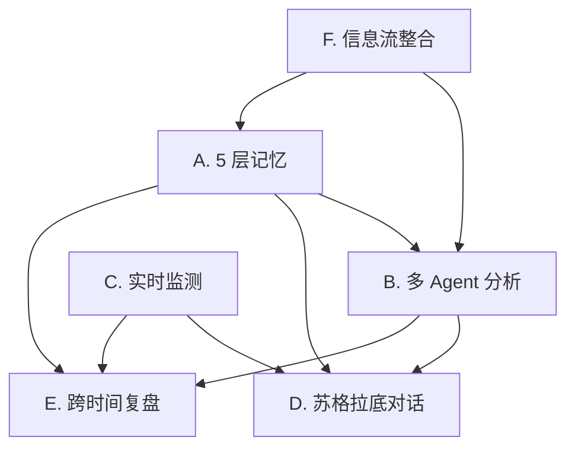
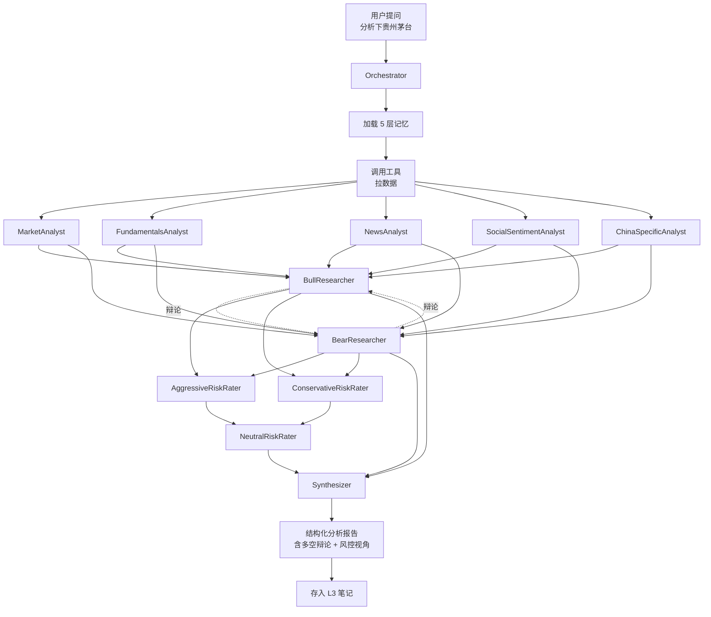

# TradeNest 产品需求文档（PRD）

> Version 1.0 · 2026-05-13 · Status: Draft
>
> Tagline: _Where your investment ideas come home to grow._
> 中文标语：让投资研究有家可归。

---

## 目录

- [1. 摘要](#1-摘要)
- [2. 项目背景与定位](#2-项目背景与定位)
- [3. 用户画像](#3-用户画像)
- [4. 核心价值主张](#4-核心价值主张)
- [5. 功能模块总览](#5-功能模块总览)
- [6. 模块 A：5 层持久记忆系统](#6-模块-a5-层持久记忆系统)
- [7. 模块 B：多 Agent 分析引擎](#7-模块-b多-agent-分析引擎)
- [8. 模块 C：实时市场监测与主动推送](#8-模块-c实时市场监测与主动推送)
- [9. 模块 D：苏格拉底式对话](#9-模块-d苏格拉底式对话)
- [10. 模块 E：跨时间复盘系统](#10-模块-e跨时间复盘系统)
- [11. 模块 F：信息流整合](#11-模块-f信息流整合)
- [12. 用户旅程](#12-用户旅程)
- [13. 技术架构概览](#13-技术架构概览)
- [14. 数据模型概览](#14-数据模型概览)
- [15. UI/UX 设计原则](#15-uiux-设计原则)
- [16. 合规边界](#16-合规边界)
- [17. 非目标](#17-非目标)
- [18. 风险评估](#18-风险评估)
- [19. 路线图概览](#19-路线图概览)
- [附录 A：术语表](#附录-a术语表)
- [附录 B：Day 1 启动清单](#附录-bday-1-启动清单)
- [附录 C：FAQ](#附录-cfaq)

---

## 1. 摘要

### 一句话

TradeNest 是一个长期陪伴自主研究型投资者的 **AI 投资研究伙伴**——它**记得**用户的所有研究、判断与决策，**盯着**市场，按用户的研究框架做**多 Agent 深度分析**，在用户做新决策时**苏格拉底式反问**，并通过**跨时间复盘**让用户看到自己判断能力的演变。

### 核心命题

| 维度 | 描述 |
|------|------|
| **它是什么** | 桌面客户端 + 浏览器扩展 + 后端服务的私人 AI 研究员 |
| **它做什么** | 记忆 / 分析 / 监测 / 反问 / 复盘 / 整合 |
| **它不做什么** | **不推荐证券、不预测股价、不替下单、不给买卖建议** |
| **谁用它** | 自主研究型投资者（自己看研报、做笔记、有判断框架的人） |
| **怎么收钱** | v1 期间不收费；产品成熟后考虑订阅制 SaaS |
| **多久做完** | 8 个月业余开发，2026-05-13 启动 |

### 与同类产品的差异

| 维度 | 主流 AI 投资工具 | TradeNest |
|------|-----------------|----------|
| 形态 | Web 单次分析 | 桌面长期陪伴 |
| 记忆 | 无 | 5 层持久记忆 |
| 个人化 | 通用 | 用户研究框架约束 |
| 对话 | 报告生成 | 苏格拉底式反问 |
| 主动性 | 用户提问驱动 | 主动推送 + 跨时间反馈 |
| 复盘 | 无 | 周 / 月 / 年报 |

### 项目状态

- **启动日期**: 2026-05-13
- **目标完成日期**: 2027-01（M8 私测发布）
- **当前阶段**: Phase 0 - 基础设施搭建
- **第一用户**: 项目作者本人（dogfood 优先）

---

## 2. 项目背景与定位

### 2.1 行业背景

#### AI + 投资研究的市场现状（2026 年）

经过 2024-2025 年大模型能力的快速演进，AI 在金融研究领域已经从"概念"进入"落地"阶段：

- **学术派**：清华系 Tauric Research 等机构开源了多 Agent 交易框架，证明了 LLM 在金融研究中的可行性
- **开源社区**：以 TradingAgents-CN（26554 stars / 5614 forks）为代表的中文增强项目验证了赛道真实需求
- **大厂派**：同花顺问财、华泰涨乐、雪球 AI、中文在线等已经发布各种 AI 投资助手
- **创业公司**：51ima（保险陪练）、各种企微 AI 客户经理副驾等垂直工具大量涌现

#### 行业的真实状况

```
真实需求（已被验证）         AI 工具供给（已存在）
─────────────────           ─────────────────
✓ 信息整合                  ✓ 同花顺问财、雪球 AI
✓ 多视角分析                ✓ TradingAgents-CN
✓ 数据查询                  ✓ AkShare、Tushare 工具
✓ 研究效率提升              ✓ 一些 RAG 工具

未被满足的真实需求
─────────────────
✗ 长期记忆（5 年研究历史）   ← TradeNest 核心
✗ 个人化框架约束             ← TradeNest 核心
✗ 跨时间反馈                 ← TradeNest 核心
✗ 苏格拉底式反问             ← TradeNest 核心
✗ 主动推送                   ← TradeNest 核心
```

#### 监管现状（中国大陆）

- **《证券、期货投资咨询管理暂行办法》** 规定：未持牌不得开展证券投资咨询业务
- **2024 年金融领域 AI 应用通知** 进一步明确：AI 工具不得提供具体投资建议
- 主流 AI 投资工具（同花顺、雪球、华泰）**均严格规避**给出"建议买入/卖出 X"的输出

这构成 TradeNest 的合规基础：**做研究伙伴，不做投顾**。

### 2.2 用户痛点

#### 当前自主研究型投资者的真实痛点

- **痛点 1：研究分散无家**
  - 微信收藏夹 / 印象笔记 / 雪球书签 / 知乎收藏 / 浏览器书签 / 脑子里——研究分散在 5+ 个地方
  - 5 年前对某只股票的判断，今天找不到了

- **痛点 2：跨时间复盘困难**
  - 当时的判断逻辑是什么？现在还成立吗？
  - 自己最近一次出错是什么时候？错在哪？
  - 没有数据支撑反思

- **痛点 3：决策时缺乏外部反馈**
  - 想买入时，没人提醒"3 个月前你说过 X 估值贵"
  - 容易被市场情绪带跑

- **痛点 4：信息整合成本高**
  - 行情看一个 App、新闻看一个 App、研报看一个 App
  - 公众号文章靠手动翻
  - 雪球讨论靠手动刷

- **痛点 5：通用 AI 不懂你**
  - 问 ChatGPT/Claude 关于股票，得到的是通用框架
  - 不知道你的投资风格、能力圈、风险偏好
  - 每次重新解释一遍上下文

### 2.3 项目定位

#### TradeNest 的定位三角

```
                    ┌─────────────────┐
                    │  长期陪伴 AI 伙伴  │
                    └────────┬────────┘
                             │
                ┌────────────┼────────────┐
                │            │            │
        ┌───────▼─────┐ ┌────▼────┐ ┌────▼─────┐
        │ 持久记忆载体  │ │ 研究伙伴 │ │ 反问导师  │
        └─────────────┘ └─────────┘ └──────────┘

           记得你做过什么   帮你做研究分析  在你做决策时反问
```

#### 三个清晰的"不是"

- ❌ **不是投顾产品** — 绝不给买卖建议
- ❌ **不是数据终端** — 不跟同花顺/Bloomberg 比数据广度
- ❌ **不是社区产品** — 不做内容分发、不做用户互动

#### 三个清晰的"是"

- ✅ **是私人研究员** — 服务一个人（你），陪 1-3-5 年
- ✅ **是研究归宿** — 你的所有研究最终汇聚于此
- ✅ **是反思工具** — 帮你看见自己判断的演变

### 2.4 项目愿景

> **5 年后，当你打开 TradeNest，你能看到自己作为一个研究者的全部足迹——
> 你研究过的每一只股票、每一次判断的演变、每一次决策的得失。
> 它让"投资是认知变现"这件事变得可见、可衡量、可成长。**

---

## 3. 用户画像

### 3.1 主要用户：自主研究型投资者

#### Persona 一：王明（项目作者本人，35 岁）

- **背景**：互联网公司工程师，工作 10 年
- **投资经历**：5 年自主投资，A 股为主，逐步加港股 / 美股
- **风格**：价值偏成长，关注科技 / 消费 / 医药
- **资金规模**：100-500 万元
- **研究习惯**：
  - 每周投入 5-10 小时研究
  - 用印象笔记记录研究
  - 关注雪球大 V、看东财公告、读招股书
  - 每年 4 月深读年报
- **痛点**：
  - 5 年下来研究笔记分散，跨时间复盘极困难
  - 工作忙时容易冲动决策
  - 现有 AI 工具（GPT/Claude）不懂他的风格
- **期望**：
  - 一个**记得他所有研究**的助手
  - 决策时能**反问他**："你 6 个月前说 X 估值贵，现在变了什么？"
  - 周末能**自动给周报**

#### Persona 二：李雪（资深从业者，40 岁）

- **背景**：金融机构研究员转私募 PM
- **投资经历**：12 年专业投研
- **风格**：深度价值，重视基本面
- **资金规模**：千万到亿元级（含管理资金）
- **研究习惯**：
  - 每天 3-4 小时研究
  - 有自己的研究模板和判断公式
  - 跟踪 50+ 公司
- **痛点**：
  - 研究模板分散在 Excel / Word / 笔记
  - 需要一个"AI 助手"按她的模板做初筛
  - 想跨时间看自己判断的命中率
- **期望**：
  - 用她的**研究公式约束 AI**（不是 AI 的通用模板）
  - **批量分析**关注的公司
  - 季度生成**判断准确率报告**

#### Persona 三：张磊（轻度爱好者，28 岁）

- **背景**：互联网产品经理
- **投资经历**：3 年定投基金 + 偶尔买股票
- **风格**：被动为主，对热点偶尔有兴趣
- **资金规模**：10-50 万
- **研究习惯**：
  - 每周 1-2 小时
  - 看雪球讨论、知乎分析
- **痛点**：
  - 容易追热点
  - 没系统研究框架
- **期望**：
  - AI 帮忙**看清自己的随机性**
  - 提醒他不要冲动
  
> **注**：Persona 三是 v1 阶段的扩展用户，TradeNest 的核心 Persona 是一和二。

### 3.2 排除用户

明确**不服务**的用户：

- ❌ **伸手党**：期待"AI 告诉我买啥"——TradeNest 永不满足
- ❌ **超短线 / 量化交易者**：他们要的是行情速度和算法，不是陪伴
- ❌ **完全新手**：连"看年报"都没做过的人不是 TradeNest 第一阶段目标

### 3.3 第一用户：作者本人

> **dogfood 是 TradeNest 立项的根本原则**。
>
> 项目作者本人即 Persona 一。每个功能的判断标准是：
> 1. 我自己用不用？
> 2. 我自己用了体验如何？
>
> 任何"理论上有用但作者不会用"的功能，**直接砍掉**。

---

## 4. 核心价值主张

### 4.1 价值金字塔

```
                         ┌──────────────┐
                         │   认知成长     │  ← 终极价值（5 年）
                         └──────┬───────┘
                                │
                 ┌──────────────┴───────────────┐
                 │      跨时间复盘 + 反问         │  ← 长期价值（1-3 年）
                 └──────────────┬───────────────┘
                                │
                ┌───────────────┴───────────────┐
                │    持久记忆 + 个人化分析         │  ← 中期价值（月）
                └───────────────┬───────────────┘
                                │
              ┌─────────────────┴─────────────────┐
              │    多 Agent 分析 + 实时数据         │  ← 短期价值（日）
              └───────────────────────────────────┘
```

### 4.2 六大核心价值

#### 价值 1：你的研究永远不会消失

**问题**：5 年前你写的研究今天找得到吗？

**TradeNest 的解法**：5 层持久记忆系统
- L1 用户画像
- L2 投资框架（你的"公式"）
- L3 研究笔记（带向量索引）
- L4 决策档案
- L5 对话历史

**用户体验**：
- 任何时候问 "贵州茅台" → 立即看到你 5 年来的所有研究
- 跨设备同步，pc / 手机 / 浏览器扩展任意访问

#### 价值 2：它真懂你（不是通用 AI）

**问题**：通用 AI 每次跟它聊都要重新解释自己。

**TradeNest 的解法**：
- 加载用户画像（投资风格 / 能力圈 / 风险偏好）
- 加载用户研究框架（用户的"投资公式"）
- 加载相关的历史研究

**用户体验**：
- 你问"分析 X" → AI 自动按你的框架分析
- AI 不会推荐超出你能力圈的标的
- AI 会反问"你之前说过 Y，这次为什么变了"

#### 价值 3：决策时逼你想清楚

**问题**：你做新决策时，没人提醒你过去的逻辑。

**TradeNest 的解法**：苏格拉底式反问
- 系统检测到"决策意向"信号（用户问"要不要买"等）
- 自动调出相关历史决策和研究
- 用反问形式呈现矛盾点

**用户体验**：
- 你说"想买宁德时代" → AI 反问"3 个月前你判断动力电池产能过剩，现在变了什么？"
- 你说"看好新能源" → AI 反问"去年这个观点你在 X 价位入场，现在你的预期是什么？"

#### 价值 4：盯着市场而你在生活

**问题**：你不能 24h 盯盘，但你想第一时间知道关键事件。

**TradeNest 的解法**：
- 后台 worker 持续监测：行情 / 公告 / 新闻 / 研报 / 资金流
- 关联到你的关注列表 / 持仓 / 历史研究
- 关键事件主动推送（桌面通知 / 邮件 / 站内）

**用户体验**：
- 茅台发了重要公告 → 桌面通知"你 3 月研究过这个，新公告改变了 X 假设"
- 你研究过的板块出现资金异动 → 主动提醒

#### 价值 5：多 Agent 深度分析

**问题**：单一 AI 视角容易偏颇。

**TradeNest 的解法**：多 Agent 编排
- 5 分析师并行（基本面 / 技术面 / 新闻 / 情绪 / A 股特色）
- 多空辩论（看多 vs 看空各 1-3 轮）
- 三方风控辩论（激进 / 保守 / 中立）
- 综合输出**辩论过程**（不是单一结论）

**用户体验**：
- 你问"分析下平安银行" → 拿到一份多视角辩论报告
- 看到看多看空各自最强的论据
- 看到风控视角的提醒

#### 价值 6：跨时间复盘让你成长

**问题**：你的判断到底准不准？提升了吗？

**TradeNest 的解法**：
- 周报：本周判断 vs 实际走势
- 月报：本月研究复盘
- 年报：判断准确率、风格演变、能力圈变化
- 跨年图表：可视化你 5 年来的成长曲线

**用户体验**：
- 每周一早上自动生成周报
- 你能看到"3 个月前我的判断准确率是 65%，本月 72%"
- 你能看到"我的能力圈从消费扩展到了科技"

---

## 5. 功能模块总览

### 5.1 六大核心模块

| 模块 | 名称 | 角色 | 优先级 | Phase |
|------|------|------|--------|-------|
| **A** | **5 层持久记忆** | 数据骨架 | ⭐⭐⭐⭐⭐ | Phase 1 |
| **B** | **多 Agent 分析引擎** | 分析能力 | ⭐⭐⭐⭐⭐ | Phase 2 |
| **C** | **实时市场监测 + 主动推送** | 主动性 | ⭐⭐⭐⭐ | Phase 3 |
| **D** | **苏格拉底式对话** | 交互核心 | ⭐⭐⭐⭐⭐ | Phase 1 |
| **E** | **跨时间复盘系统** | 长期价值 | ⭐⭐⭐⭐ | Phase 3 |
| **F** | **信息流整合** | 数据广度 | ⭐⭐⭐ | Phase 2 |

### 5.2 模块依赖关系



### 5.3 阶段化交付

```
Phase 0 (Week 1-4)  ▶ 基础设施 + 最小 Agent loop + AkShare 数据源
Phase 1 (Month 2-3) ▶ 模块 A（5 层记忆）+ 模块 D（苏格拉底对话 v1）
Phase 2 (Month 4-5) ▶ 模块 B（多 Agent）+ 模块 F（信息流）
Phase 3 (Month 6-7) ▶ 模块 C（推送）+ 模块 E（复盘）
Phase 4 (Month 8)   ▶ 打磨 + 私测发布
```

---

## 6. 模块 A：5 层持久记忆系统

### 6.1 为什么需要 5 层记忆

#### 通用 AI 记忆的不足

主流 AI 工具（ChatGPT / Claude / 各类 RAG）的记忆方案：
- **方案 1**: 长上下文（1M tokens）—— 但每次会话仍是孤立的
- **方案 2**: 简单 RAG —— 把笔记向量化，但丢失结构
- **方案 3**: 单层 Memory（OpenAI Memory）—— 太扁平，不够分层

**它们共同的问题**：
- ❌ 不区分"事实 vs 偏好 vs 框架"
- ❌ 不支持跨会话引用
- ❌ 没有时间维度
- ❌ 不可控、不可解释

#### TradeNest 的方案：分层 + 显式

5 层各司其职，互相引用：

```
L1 用户画像（你是谁）
  ↓ 影响
L2 研究框架（你怎么看股票）
  ↓ 影响
L3 研究笔记（你研究了什么）
  ↓ 影响
L4 决策档案（你做了什么决定）
  ↓ 影响
L5 对话历史（你跟 AI 怎么聊的）
```

### 6.2 L1：用户画像（User Profile）

#### 内容

```yaml
# 示例 user_profile.yaml
identity:
  name: 王明
  age: 35
  occupation: 软件工程师

investment_style:
  primary: 价值成长
  secondary: 行业轮动
  
risk_preference:
  max_drawdown: 30%
  position_concentration: max_30%_per_stock

capability_circle:
  strong: [互联网, 消费品, 半导体]
  learning: [医药, 新能源]
  avoid: [周期股, 衍生品]

constraints:
  capital_size: 100-500万
  liquidity_need: 低
  time_horizon: 3-5年
  account_type: A股 + 港股 + 美股
  
language:
  preferred: 中文
  technical_level: 高（懂财报 / 懂估值模型）
```

#### 维护方式

- **初次填写**：用户首次启动时引导填写（10-15 分钟问卷）
- **持续更新**：
  - AI 在对话中识别到偏好变化时建议更新
  - 用户每月有一次"画像健检"（提示是否调整）
  - 重大决策时（如风险偏好变化）触发更新

#### 在分析中的作用

每次 Agent 分析时，**自动加载 L1 到 system prompt**：

```
你正在为这个用户服务：
- 投资风格：价值成长
- 能力圈：互联网 / 消费品 / 半导体
- 当前研究的标的不在能力圈时，主动提醒
- 不要给出超出风险偏好的建议
- 用中文回复，技术深度可以高
```

### 6.3 L2：研究框架（Research Framework / "公式"）

#### 概念

用户的"投资公式"——他用什么角度评估一只股票。

#### 示例

```yaml
# 王明的研究框架
framework:
  name: 价值成长综合框架
  version: 2.1
  
checklist:
  - id: business_quality
    name: 生意属性
    weight: 25%
    questions:
      - 这是好生意吗？（ROIC > 15%）
      - 现金流如何？（自由现金流 / 净利润 > 70%）
      - 护城河在哪？
    
  - id: growth_quality
    name: 成长质量
    weight: 25%
    questions:
      - 收入增速 vs 行业
      - 增长是来自规模 还是质量？
      - 复合增长率是否可持续？
    
  - id: valuation
    name: 估值
    weight: 25%
    questions:
      - PE / PB / PEG 对比历史和同行
      - DCF 隐含的增长假设是否合理？
      - 当前估值在历史什么分位？
    
  - id: management
    name: 管理层
    weight: 15%
    questions:
      - 创始人 / CEO 持股
      - 历史言行一致性
      - 资本配置能力
    
  - id: risk
    name: 风险
    weight: 10%
    questions:
      - 行业系统性风险
      - 公司特定风险
      - 政策风险

deal_breakers:
  - 财务造假嫌疑
  - 主营业务持续亏损 > 3 年
  - ROIC < 8%（除非转型期）

position_sizing:
  high_conviction: 5-10%
  medium: 3-5%
  exploratory: 1-2%
```

#### 用法

- 每次分析时，AI **必须按框架顺序输出**
- 不允许跳过 deal_breakers 检查
- 用户可以版本化框架（v1 / v2 / v3），看自己框架的演变

### 6.4 L3：研究笔记（Research Notes）

#### 数据结构

```sql
CREATE TABLE research_notes (
    id UUID PRIMARY KEY,
    stock_code TEXT NOT NULL,         -- A 股代码 / 港股代码 / 美股代码
    stock_name TEXT NOT NULL,
    title TEXT NOT NULL,
    content TEXT NOT NULL,            -- Markdown
    tags TEXT[],                      -- 标签
    source TEXT,                      -- 'manual' / 'imported' / 'ai_generated'
    framework_version TEXT,           -- 用了哪个版本的框架
    
    -- 向量化（用 pgvector）
    title_embedding VECTOR(1024),
    content_embedding VECTOR(1024),
    
    -- 元数据
    created_at TIMESTAMP DEFAULT NOW(),
    updated_at TIMESTAMP DEFAULT NOW(),
    
    -- 关联
    parent_note_id UUID,              -- 引用其他笔记
    related_decisions UUID[],         -- 关联到决策
    
    INDEX idx_stock_code (stock_code),
    INDEX idx_tags USING GIN (tags),
    INDEX idx_content_vec USING hnsw (content_embedding vector_cosine_ops)
);
```

#### 三种来源

1. **手动写**：用户在桌面客户端 / 浏览器扩展直接写
2. **导入**：
   - 从印象笔记 / Notion / 飞书导入
   - 从微信收藏 / 雪球收藏抓取
   - PDF 研报 OCR
3. **AI 生成**：
   - Agent 分析后生成"分析笔记"
   - 用户确认后存入

#### 检索方式

- **关键字搜索**：标题 / 标签
- **向量搜索**：语义相似度（"找跟茅台估值方法类似的笔记"）
- **时间范围**：按月 / 季度 / 年浏览
- **股票维度**：按股票代码聚合

### 6.5 L4：决策档案（Decision Log）

#### 数据结构

```sql
CREATE TABLE decision_log (
    id UUID PRIMARY KEY,
    timestamp TIMESTAMP NOT NULL,
    
    -- 决策内容
    action TEXT NOT NULL,             -- 'buy' / 'sell' / 'hold' / 'watch' / 'skip'
    stock_code TEXT NOT NULL,
    quantity NUMERIC,                 -- 数量（手 / 股）
    price NUMERIC,                    -- 决策时价格
    
    -- 决策理由
    reasoning TEXT NOT NULL,          -- Markdown 详细理由
    framework_outputs JSONB,          -- L2 框架的每项打分
    related_notes UUID[],             -- 关联的研究笔记
    
    -- 决策来源
    triggered_by TEXT,                -- 'manual' / 'event_X' / 'periodic_review'
    confidence_level INTEGER,         -- 1-5 自评信心
    
    -- 后续追踪
    actual_executed BOOLEAN,          -- 是否真的执行了
    execution_price NUMERIC,
    execution_time TIMESTAMP,
    
    -- 复盘
    review_at TIMESTAMP,              -- 计划复盘时间（如 3 个月后）
    actual_outcome JSONB,             -- 实际结果（自动填充）
    lessons_learned TEXT,             -- 用户写的反思
    
    -- 向量化
    reasoning_embedding VECTOR(1024),
    
    INDEX idx_stock (stock_code),
    INDEX idx_timestamp (timestamp DESC)
);
```

#### 关键设计：决策**不一定**对应交易

- **action='watch'** — 我决定继续观察（不交易）
- **action='skip'** — 我决定不买（哪怕看起来便宜）
- **action='hold'** — 我决定继续持有（拒绝卖）

这些**非交易决策**也有研究价值，TradeNest 一并记录。

#### 后续追踪

- 系统每天检查所有 `review_at <= now()` 的决策
- 自动拉取标的的实际走势
- 在周报 / 月报中呈现"决策回顾"

### 6.6 L5：对话历史（Conversation Archive）

#### 数据结构

```sql
CREATE TABLE conversations (
    id UUID PRIMARY KEY,
    title TEXT,                       -- 自动生成或用户编辑
    started_at TIMESTAMP DEFAULT NOW(),
    last_message_at TIMESTAMP,
    
    -- 会话标签
    tags TEXT[],
    related_stock_codes TEXT[],
    
    -- 摘要（用于跨会话搜索）
    summary TEXT,
    summary_embedding VECTOR(1024),
    
    INDEX idx_tags USING GIN (tags),
    INDEX idx_summary_vec USING hnsw (summary_embedding vector_cosine_ops)
);

CREATE TABLE messages (
    id UUID PRIMARY KEY,
    conversation_id UUID REFERENCES conversations(id),
    timestamp TIMESTAMP DEFAULT NOW(),
    role TEXT NOT NULL,               -- 'user' / 'assistant' / 'tool'
    content TEXT NOT NULL,
    
    -- 工具调用
    tool_calls JSONB,                 -- 这条消息触发了哪些工具
    tool_results JSONB,
    
    -- 引用追溯
    referenced_notes UUID[],          -- 这条消息引用了哪些笔记
    referenced_decisions UUID[],      -- 引用了哪些决策
    
    -- 用于压缩
    importance_score FLOAT,           -- 0-1 重要性
    is_summarized BOOLEAN DEFAULT FALSE,
    
    INDEX idx_conv_time (conversation_id, timestamp)
);
```

#### 跨会话连续性

每次新对话，系统自动加载：
- 最近 3 次相关对话的摘要
- 跟当前主题相关的研究笔记
- 跟当前股票相关的决策历史

这样用户感受到的是"AI 记得我们以前聊过什么"，而不是每次都重新开始。

### 6.7 5 层记忆的协同

#### 一次完整查询的记忆访问示例

用户问："我想买入贵州茅台 200 股，¥1700。"

```
[1] 加载 L1 用户画像
    → 王明，价值成长风格，茅台属于消费板块（能力圈内 ✓）

[2] 加载 L2 研究框架
    → 价值成长框架 v2.1
    → 检查 deal_breakers（茅台无财务造假嫌疑 ✓）

[3] 检索 L3 研究笔记
    → "贵州茅台 2026Q1 财报分析"（3 天前）
    → "茅台估值历史分位"（2 个月前）
    → "白酒行业政策风险"（6 个月前）

[4] 检索 L4 决策档案
    → 2026-03 你以 ¥1650 买入 100 股
    → 2026-02 你判断"白酒板块短期承压"
    → 2025-11 你写过"目标位 ¥1500 才出手"

[5] 加载 L5 对话历史
    → 上周对话："茅台估值偏高，先观察"

[6] 综合输出（苏格拉底式反问）
    → "你 5 个月前判断'白酒短期承压'，现在变了什么？"
    → "你 6 个月前说'¥1500 才出手'，现在 ¥1700 加仓的理由是？"
    → "上周你还说'估值偏高先观察'，本周加仓的新信息是？"
```

这就是 5 层记忆协同的威力。

---

## 7. 模块 B：多 Agent 分析引擎

### 7.1 为什么用多 Agent

#### 单 Agent 的不足

让一个 LLM "全面分析一只股票"——
- 输出会偏向某种视角（基本面或技术面或情绪面）
- 容易产生"两边说"式的中立但无用的报告
- 不会有真正的辩论 / 争议

#### 多 Agent 的优势

- **专业化**：每个 Agent 专注一个视角
- **多样化输出**：辩论本身比单一结论更有价值
- **风险识别**：风控 Agent 强制提出反对意见
- **可审计**：每个 Agent 的输出可以独立追溯

#### TradeNest 的多 Agent 编排

借鉴自 TradingAgents-CN 的业务设计，但**代码完全自己写**。差异在于：
- TradingAgents-CN 是单次分析
- TradeNest 把多 Agent 输出**喂给 5 层记忆**，跨时间累积

### 7.2 Agent 角色清单

#### 第一层：分析师团队（5 个）

| Agent | 角色 | 输入 | 输出 |
|-------|------|------|------|
| **MarketAnalyst** | 技术面分析师 | 股票代码、时间区间 | 技术面分析报告 |
| **FundamentalsAnalyst** | 基本面分析师 | 股票代码、最新财报 | 基本面分析报告 |
| **NewsAnalyst** | 新闻分析师 | 股票代码、最近 30 天新闻 | 事件影响分析 |
| **SocialSentimentAnalyst** | 情绪分析师 | 雪球 / 知乎讨论 | 市场情绪报告 |
| **ChinaSpecificAnalyst** | A 股特色分析师 | 北向资金、龙虎榜、停牌等 | A 股特色信号 |

#### 第二层：研究员团队（多空辩论）

| Agent | 角色 | 输入 | 输出 |
|-------|------|------|------|
| **BullResearcher** | 多头研究员 | 5 分析师报告 | 看多论点（必须给出最强论据） |
| **BearResearcher** | 空头研究员 | 5 分析师报告 | 看空论点（必须给出最强反驳） |

辩论过程：1-3 轮，每轮多方对单方观点反驳。

#### 第三层：风控团队（三方辩论）

| Agent | 角色 | 输入 | 输出 |
|-------|------|------|------|
| **AggressiveRiskRater** | 激进风控 | 多空辩论 | "为什么这次值得冒险" |
| **ConservativeRiskRater** | 保守风控 | 多空辩论 | "这次可能错的地方" |
| **NeutralRiskRater** | 中立风控 | 双方意见 | 综合风险评估 |

#### 第四层：综合输出 Agent

| Agent | 角色 | 输入 | 输出 |
|-------|------|------|------|
| **Synthesizer** | 综合输出 | 上述全部 | **结构化分析报告**（不是建议） |

### 7.3 编排流程



### 7.4 Agent 实现细节

#### 基本面分析师 system prompt 模板

```
你是 TradeNest 的基本面分析师 Agent。

【你的角色】
- 专注公司财务、商业模式、护城河、管理层
- 不看技术面、不看市场情绪
- 输出必须客观、基于数据

【你必须做的】
1. 检查最近 4 个季度财报关键指标
2. 与同行业可比公司对比
3. 识别异常财务信号
4. 评估盈利质量（应收 / 现金流 / 减值）

【你不能做的】
- ❌ 给出"建议买入/卖出"
- ❌ 预测股价
- ❌ 给目标价
- ✅ 你只输出"基本面是否健康"的判断

【输出格式】
JSON 格式：
{
  "summary": "一句话总结",
  "strengths": [...],
  "weaknesses": [...],
  "anomalies": [...],
  "framework_score": {  // 按用户的 L2 框架打分
    "business_quality": 0-100,
    "growth_quality": 0-100,
    "valuation": 0-100,
    "management": 0-100,
    "risk": 0-100
  }
}
```

#### 多空辩论的实现

```python
# 简化伪代码
async def bull_bear_debate(
    analyst_reports: list[AnalystReport],
    rounds: int = 2,
) -> DebateResult:
    bull_pos = await BullResearcher.initial_argument(analyst_reports)
    bear_pos = await BearResearcher.initial_argument(analyst_reports)
    
    for round_i in range(rounds):
        bull_pos = await BullResearcher.rebut(
            previous=bull_pos,
            opponent=bear_pos,
        )
        bear_pos = await BearResearcher.rebut(
            previous=bear_pos,
            opponent=bull_pos,
        )
    
    return DebateResult(
        bull_final=bull_pos,
        bear_final=bear_pos,
        rounds=rounds,
    )
```

### 7.5 性能与成本控制

#### 默认编排（成本敏感）

- 5 分析师并行（用 Sonnet 4.6）
- 多空辩论 2 轮（用 Sonnet 4.6）
- 风控辩论 1 轮（用 Sonnet 4.6）
- 综合输出（用 Opus 4.7）

**预估**：单次完整分析约 $0.5-1.5 USD（按 2026 年 5 月价格）

#### 深度模式（用户主动触发）

- 多空辩论 3-5 轮
- 综合输出用 Opus 4.7
- 加深度网络搜索

**预估**：$2-5 USD/次

#### 经济模式

- 用 DeepSeek V3.2 / Qwen3 替代部分 Agent
- 关闭社交情绪 / 中国特色（仅基本 + 技术 + 新闻）
- 取消辩论环节

**预估**：$0.05-0.2 USD/次

### 7.6 输出格式

#### 报告结构（中文 Markdown）

```markdown
# 贵州茅台 (600519) 多视角分析报告

> 生成时间：2026-05-13 14:30
> 用户框架版本：v2.1（价值成长综合框架）
> Agent 版本：v0.3.0

## 1. 摘要（仅事实陈述，不含建议）
[Synthesizer 输出 200-300 字]

## 2. 五分析师报告
### 2.1 基本面 [score: X]
...
### 2.2 技术面
...
### 2.3 新闻
...
### 2.4 市场情绪
...
### 2.5 A 股特色
...

## 3. 多空辩论
### 3.1 看多核心论据
1. ...
2. ...
### 3.2 看空核心论据
1. ...
2. ...
### 3.3 辩论焦点
- 焦点 1：[多方观点] vs [空方观点]

## 4. 风险视角
### 4.1 激进派
"如果你冒险，这是最强的理由"
### 4.2 保守派
"如果你不冒险，这是最强的理由"
### 4.3 中立综合
[综合三方风险评估]

## 5. 跟你历史研究的对比（来自 5 层记忆）
- 你 3 个月前的判断：...
- 当时的核心理由：...
- 现在的变化：...

## 6. 反问
基于以上，给你的几个问题：
1. ...
2. ...
3. ...

---
⚠️ 本报告仅作研究参考，不构成投资建议。
```

---

## 8. 模块 C：实时市场监测与主动推送

### 8.1 监测对象

#### 三类监测目标

```
        ┌──────────────────────────┐
        │      监测目标             │
        └────────────┬─────────────┘
                     │
        ┌────────────┼────────────┐
        │            │            │
   ┌────▼─────┐ ┌────▼─────┐ ┌────▼─────┐
   │ 持仓     │ │ 关注列表  │ │ 历史研究  │
   │ holdings │ │ watchlist│ │ research │
   └──────────┘ └──────────┘ └──────────┘
```

#### 优先级

- **P0 (立即推送)**：持仓股票的重大事件
- **P1 (15 分钟内)**：关注列表的关键事件
- **P2 (每天汇总)**：历史研究股票的动态
- **P3 (周报)**：板块 / 大盘整体动向

### 8.2 监测维度

| 维度 | 数据源 | 频率 | 触发条件 |
|------|-------|------|----------|
| 行情异动 | AkShare 实时 | 5 秒 | 涨跌幅 > 5%、量比 > 3 |
| 公告 | 东方财富 / 巨潮 | 30 秒 | 任何新公告 |
| 新闻 | 财联社 / 多源 | 1 分钟 | 跟监测对象相关 |
| 研报 | 慧博 / 东财 | 1 小时 | 新研报 + 评级变化 |
| 资金流 | AkShare | 1 分钟（盘中） | 北向 / 主力 / 大单异动 |
| 公众号 | Playwright | 1 小时 | 关键账号发文 |
| 雪球 | Playwright | 30 分钟 | 关注股的高赞讨论 |

### 8.3 推送策略

#### 推送渠道

```
桌面通知 (本地)        → P0 / P1 立即可见
邮件                  → P0 备份 / P3 汇总
站内 Inbox           → 全部
浏览器扩展角标        → 数量提示
```

#### 推送内容模板

```markdown
🚨 P0 持仓事件
[公司] 发布了 [公告类型]
关键变化：...
你的研究里相关的笔记：[3 条] [点击展开]
你之前的判断：[1 条决策] 
建议复盘：[一键打开复盘对话]
```

#### 防打扰

- 每天最多推送 N 条 P2/P3（用户配置）
- 夜间静默（用户配置时段）
- 周末降级（仅 P0）

### 8.4 推送的触发反思

**重要设计**：每条推送都关联到用户的"反思入口"。

例如：
- 收到"茅台公告"推送 → 旁边有按钮"复盘你的判断"
- 点击 → 自动打开对话："你 3 月研究过茅台，新公告是否改变 X 假设？"

让推送不只是信息流，而是**反思触发器**。

---

## 9. 模块 D：苏格拉底式对话

### 9.1 哲学基础

> "我唯一知道的就是我什么都不知道。" —— 苏格拉底
>
> "AI 唯一不能做的就是告诉你怎么投资。" —— TradeNest

苏格拉底教学法的核心：**不给答案，问问题**。

TradeNest 的对话哲学：
- ❌ 不替你决策
- ❌ 不告诉你"该买"或"该卖"
- ✅ 反问 + 整理 + 摆事实
- ✅ 强迫你自己想清楚

### 9.2 对话风格规则

#### 三个永远不说

- 永远不说："你应该买入 / 卖出"
- 永远不说："这只股票会涨到 X"
- 永远不说："建议你..."

#### 三个永远要说

- 永远要说："你之前说过 X，现在 Y，差异在哪？"
- 永远要说："这个判断的关键假设是什么？"
- 永远要说："如果你错了会怎样？"

#### 一个隐含原则

不替用户做决策，**但要让用户决策更好**。

### 9.3 反问的四种类型

#### 类型 1：跨时间反问

> 你 3 个月前说 X，现在变了什么？

触发：用户做出与历史决策相反的意向。

#### 类型 2：假设挑战

> 这个判断的关键假设是 A、B、C，哪个最脆弱？

触发：用户给出新判断时。

#### 类型 3：能力圈反问

> 这个标的属于你的能力圈吗？

触发：用户研究超出 L1 capability_circle.strong 的标的。

#### 类型 4：情绪反问

> 你说"必涨"——这是你的研究结论还是希望它涨？

触发：用户用了情绪化词汇（必涨、稳赚、肯定等）。

### 9.4 反问触发器

#### 关键词触发

| 用户说 | 触发反问 |
|--------|---------|
| "必涨 / 稳赚 / 肯定" | 情绪反问 |
| "全仓 / 满仓 / all in" | 风险反问 + 仓位提醒 |
| "我觉得 / 我感觉" | 假设挑战 |
| "听说 / 别人说" | 信息来源反问 |

#### 行为触发

- 用户提出**新决策意向** → 跨时间反问
- 用户研究**新行业** → 能力圈反问
- 用户**修改 L2 框架** → 框架一致性反问

### 9.5 反问模板示例

```python
# 简化伪代码
async def generate_socratic_response(
    user_input: str,
    memory: FiveLayerMemory,
) -> str:
    # 1. 检查情绪化词汇
    if has_emotional_words(user_input):
        return f"你说'{extract_emotional_word(user_input)}'。这是你的研究结论，还是希望？"
    
    # 2. 检查跨时间矛盾
    related_decisions = memory.find_related_decisions(user_input)
    if related_decisions:
        contradictions = find_contradictions(user_input, related_decisions)
        if contradictions:
            return format_cross_time_question(contradictions)
    
    # 3. 检查能力圈
    stock = extract_stock(user_input)
    if stock and stock.industry not in memory.profile.capability_circle.strong:
        return f"{stock.name} 属于 {stock.industry}，超出你能力圈范围。是你最近在学的领域吗？"
    
    # 4. 默认：假设挑战
    return f"这个判断有几个关键假设：[A, B, C]。哪个最容易被证伪？"
```

### 9.6 用户公式约束

如果用户写了 L2 研究框架，**Agent 必须严格按框架输出**：

- 用户框架要求"必查 ROIC" → AI 必须输出 ROIC
- 用户 deal_breakers 要求"避开周期股" → AI 不能推研究周期股
- 用户 position_sizing 规则 → AI 反问时引用规则

这是用户框架对 AI 的"主权"。

---

## 10. 模块 E：跨时间复盘系统

### 10.1 三种复盘报告

| 报告 | 频率 | 内容 |
|------|------|------|
| **周报** | 每周一 9:00 | 本周判断 vs 实际、本周关键事件、待办 |
| **月报** | 每月 1 号 9:00 | 月度判断准确率、风格变化、能力圈进展 |
| **年报** | 每年 1/15 | 全年成长曲线、判断演变、L2 框架升级建议 |

### 10.2 周报模板

```markdown
# TradeNest 周报：2026-05-04 ~ 2026-05-10

## 📊 本周数据
- 你做了 N 次研究（笔记 3 条 / 决策 1 次 / 对话 5 次）
- 关注股 X 只，持仓 Y 只
- AI Agent 调用 Z 次

## 🎯 本周判断追踪
| 时间 | 标的 | 你的判断 | 实际走势 |
|------|------|---------|---------|
| ... | ... | ... | ... |

## 💡 本周关键事件
- 茅台 Q1 财报：[要点] [你的研究链接]
- ...

## 🔍 待复盘的决策
你 3 个月前的决策到了复盘时间：
- [Decision X] — 当时理由：... 实际结果：...

## 📚 你本周新研究的笔记
- [Note 1]
- [Note 2]

## 🤔 给你的反思问题
1. 本周哪个判断最有信心？为什么？
2. 本周哪个判断最不确定？
3. 你的能力圈在本周扩展了吗？
```

### 10.3 月报模板

更深入的统计 + 演变分析：
- 判断准确率趋势图
- 持仓变化与板块轮动
- L2 框架使用统计（哪些维度用得多 / 少）
- 能力圈成长地图

### 10.4 年报模板

终极复盘：
- 5 年成长曲线（如果有数据）
- 投资风格演变可视化
- L2 框架版本演变
- 给明年的"自我建议"

### 10.5 数据基础

复盘报告依赖：
- L4 决策档案（带 review_at 字段）
- L3 研究笔记
- 实际市场数据（自动拉取走势对比）
- L5 对话历史的统计

---

## 11. 模块 F：信息流整合

### 11.1 数据源清单

| 类别 | 来源 | 接入方式 | 优先级 |
|------|------|---------|--------|
| **行情** | AkShare | API | P0 |
| **行情（升级）** | Tushare Pro | API + Token | P1 |
| **公告** | 东方财富 / 巨潮 | API（非官方） | P0 |
| **新闻** | 财联社 RSS | RSS | P1 |
| **研报** | 慧博 + 东财研报 | Playwright | P1 |
| **公众号** | 微信文章 | Playwright（用户登录） | P2 |
| **雪球** | 关注 + 讨论 | Playwright（用户登录） | P2 |
| **知乎** | 投资话题 | Playwright（用户登录） | P3 |
| **Web 通用搜索** | Brave / Anthropic | API | P1 |

### 11.2 浏览器自动化方案

#### 为什么用 Playwright + 用户本地浏览器

- **合规**：用户自己的登录态，不存第三方密码
- **稳定**：避免账号封禁（不大规模爬虫）
- **真实**：拿到的就是用户能看到的内容

#### 实现

```python
# 简化示例
async def fetch_xueqiu_followed():
    # 用户的 Chrome / Edge profile 直接打开
    browser = await playwright.chromium.launch_persistent_context(
        user_data_dir="~/.tradenest/browser",
        headless=True,
    )
    page = await browser.new_page()
    await page.goto("https://xueqiu.com/u/me/follow")
    # ... 解析关注列表
```

### 11.3 信息处理 Pipeline

```
原始内容 → 去重 → 实体抽取 → 关联用户记忆 → 入库 → 触发推送
```

#### 实体抽取

- 股票代码自动识别（基于股票名称词典 + 上下文）
- 行业 / 概念识别
- 时间识别

#### 关联用户记忆

- 抓到一篇文章提到"茅台" → 自动关联 L3 中关于茅台的笔记
- 抓到"消费板块" → 关联用户在该板块的研究

### 11.4 合规与版权

- ❌ 不公开传播第三方付费内容
- ❌ 不绕过付费墙
- ✅ 仅供用户**个人**研究使用
- ✅ 抓取的内容存在用户本地，不上传共享

---

## 12. 用户旅程

### 旅程 1：首次启动 — 建立画像

```
用户下载 TradeNest 桌面客户端
  ↓
启动 → 引导问卷（10-15 分钟）
  ↓
填写：投资风格 / 资金规模 / 能力圈 / 风险偏好
  ↓
（可选）填写 L2 研究框架（或用预设模板）
  ↓
首次对话：你好，我是你的研究伙伴
  ↓
引导：可以从导入 1 篇研究笔记开始？
```

### 旅程 2：日常研究 — 对话式分析

```
用户：分析下贵州茅台

TradeNest：
  [1] 加载 5 层记忆（系统）
  [2] 调用工具拉数据（Tools）
  [3] 5 分析师并行分析
  [4] 多空辩论
  [5] 风控辩论
  [6] 综合输出

用户：看到报告 + 跟自己历史研究的对比
  ↓
点击"保存为研究笔记" → L3
  ↓
（可选）点击"创建决策档案" → L4
```

### 旅程 3：决策时反问

```
用户：我想买 100 股茅台 ¥1700

TradeNest：
  - 检查 L4：3 个月前你买过 ¥1650
  - 检查 L3：你 6 个月前说"¥1500 才出手"
  - 检查 L1：在能力圈内 ✓
  - 生成反问：
    "你 6 个月前说'¥1500 才出手'，
     现在 ¥1700 加仓的新理由是什么？"
  
用户：因为新公告改变了我的估值假设
  ↓
TradeNest：把这个决策 + 新理由 → L4
```

### 旅程 4：周一早上的周报

```
周一 9:00 - 桌面通知

打开 TradeNest →
  - 上周判断追踪
  - 本周关键事件汇总
  - 待复盘决策提醒
  - 反思问题

用户花 15 分钟读完
  ↓
点击"开始复盘对话"
  ↓
进入苏格拉底式对话
```

### 旅程 5：年报与成长

```
2027-01-15 触发年报

报告内容：
  - 你 2026 年做了 N 次研究、M 次决策
  - 判断准确率：65% → 72% (上升)
  - 能力圈：消费 + 互联网 → +半导体
  - L2 框架经历了 v1.0 → v2.1 三次升级
  - 最准的判断 / 最错的判断

用户：导出 PDF 留存
  ↓
（未来）分享给朋友 / 简历
```

---

## 13. 技术架构概览

> 详见 [ARCHITECTURE.md](./0005-整体架构.md)。

### 13.1 整体架构

```
┌─────────────────────────────────────────────┐
│           表现层（用户接触面）                  │
├──────────────┬──────────────┬───────────────┤
│ 桌面客户端     │ 浏览器扩展     │ (未来) 移动端   │
│ Tauri+React  │ WXT          │               │
└──────────────┴──────────────┴───────────────┘
                    ↓
┌─────────────────────────────────────────────┐
│         应用层（FastAPI）                     │
│  REST + WebSocket + SSE                     │
└─────────────────────────────────────────────┘
                    ↓
┌─────────────────────────────────────────────┐
│         Agent 内核层                         │
│  Anthropic SDK + LangGraph 编排              │
│  Tools / Memory / Skills / Hooks             │
└─────────────────────────────────────────────┘
                    ↓
┌────────────┬───────────────┬────────────────┐
│ 数据层       │ 采集层          │ LLM 层         │
│ PG+pgvector │ AkShare       │ Claude        │
│ Redis       │ Playwright    │ DeepSeek/Qwen │
└────────────┴───────────────┴────────────────┘
```

### 13.2 关键技术决策

> 详见 [TECH-STACK.md](./0006-技术选型.md) 和 [DECISIONS.md](./0003-决策日志ADR.md)。

- 后端 Python 3.12
- Agent: Anthropic SDK + LangGraph
- 数据库: PG 16 + pgvector
- 桌面: Tauri 2.x

---

## 14. 数据模型概览

> 详见 [DATA-MODEL.md](./0007-数据模型.md)。

### 14.1 核心表

```
用户层：
  - user_profile（L1）
  - research_framework（L2）

记忆层：
  - research_notes（L3，含 vector embedding）
  - decision_log（L4）
  - conversations + messages（L5）

市场层：
  - stocks
  - quotes
  - kline
  - announcements
  - news

Agent 层：
  - agent_runs
  - tool_calls
  - traces

监测层：
  - watchlist
  - alerts
  - notifications

复盘层：
  - reviews
  - judgement_outcomes
```

---

## 15. UI/UX 设计原则

### 15.1 三大设计原则

#### 原则 1：克制（Restraint）

- 不要花哨动画
- 不要过度色彩
- 不要 push 推送轰炸

参考：Linear、Notion、Arc 的设计语言。

#### 原则 2：对话优先（Conversation First）

主界面是**对话**，不是仪表盘。

数据 / 图表是**对话上下文的补充**，不是核心。

#### 原则 3：可追溯（Traceable）

每个 AI 输出旁边有：
- 引用来源（哪条笔记、哪个决策、哪份数据）
- 思考过程（哪个 Agent、哪个工具）
- 时间戳

### 15.2 桌面客户端布局

```
┌──────────────────────────────────────────────┐
│ TradeNest                          [⚙️] [👤]  │
├──────────┬─────────────────────────┬─────────┤
│          │                         │         │
│ 侧边栏    │   主对话区              │ 上下文区 │
│          │                         │         │
│ - 对话    │  [消息流]                │ 当前股票  │
│ - 关注列表 │                         │ 相关笔记  │
│ - 笔记    │  ──────────────────     │ 相关决策  │
│ - 决策    │  [输入框]                │         │
│ - 复盘    │  发送                    │         │
│          │                         │         │
└──────────┴─────────────────────────┴─────────┘
```

### 15.3 浏览器扩展

```
浮窗设计（不抢主角）
- 在雪球 / 东财页面右侧浮出
- 一键"存为笔记"
- 一键"问 TradeNest"
```

---

## 16. 合规边界

> 详见独立文档 [COMPLIANCE.md](./0002-合规边界.md)（**所有开发者必读**）。

### 16.1 监管依据

- **《证券、期货投资咨询管理暂行办法》**
- **《证券投资顾问业务暂行规定》**
- **《关于规范金融领域 AI 应用的通知》（2024）**
- **《个人信息保护法》**

### 16.2 红线（绝对不做）

❌ **不推荐具体证券**：
- 不说"建议买入 / 卖出 X"
- 不说"X 是个好机会"
- 不出"今日推荐"

❌ **不预测股价**：
- 不说"X 会涨到 Y 元"
- 不出"目标价 X"
- 不说"短期内会涨"

❌ **不替下单**：
- 不连接券商 API 做自动交易
- 不接受用户授权下单

❌ **不承诺收益**：
- 不说"用了能赚 X%"
- 不说"成功率 N%"

### 16.3 灰区（可做但需谨慎）

✅ **信息整理**：把数据 / 新闻 / 研报整合呈现

✅ **多视角分析**：按用户框架做结构化分析（不出结论）

✅ **跨时间反馈**：呈现用户历史决策与现在的对比

✅ **苏格拉底反问**：问问题不给答案

✅ **风险提示**：明确告知风险

### 16.4 输出审查机制

```python
# 简化伪代码
def output_compliance_check(text: str) -> tuple[bool, str]:
    """每次 AI 输出前必经的检查。"""
    forbidden_phrases = [
        r"建议(买入|卖出|加仓|减仓)",
        r"目标价",
        r"\d+\s*元.*会涨",
        r"必涨|稳赚",
    ]
    for pattern in forbidden_phrases:
        if re.search(pattern, text):
            return False, f"违反合规规则：{pattern}"
    return True, "OK"
```

每条 AI 输出**先经过审查再展示**。违规则重新生成或拒绝。

---

## 17. 非目标

### 17.1 v1 阶段不做

- ❌ **量化策略 / 自动交易**：合规风险 + 偏离定位
- ❌ **社区 / 内容分享**：违背"私人陪伴"定位
- ❌ **多用户协作**：v1 是单用户产品
- ❌ **Web 端**：先聚焦桌面 + 扩展
- ❌ **移动端**：v1 不做（v2 考虑）
- ❌ **高频交易支持**：定位长期研究
- ❌ **币圈 / NFT / DeFi**：超出股票范围

### 17.2 永远不做

- ❌ **投资建议 / 推荐股票**：合规永远不允许
- ❌ **保证收益**：违法
- ❌ **代客理财**：需要牌照

### 17.3 v2+ 可考虑

- v2: SaaS 多用户版本
- v2: 移动端
- v2: 跨用户的"匿名研究协作"
- v3: 智能投顾（仅在拿到牌照后）

---

## 18. 风险评估

### 18.1 法律 / 合规风险

| 风险 | 概率 | 严重度 | 缓解措施 |
|------|------|-------|---------|
| 监管认定为"未持牌投顾" | 中 | 极高 | 严守红线 + 用户协议 + 输出审查 |
| 用户起诉"AI 误导决策" | 低 | 高 | 免责声明 + 不给具体建议 |
| 数据源版权问题 | 中 | 中 | 仅本地使用 + 不公开传播 |

### 18.2 技术风险

| 风险 | 概率 | 严重度 | 缓解措施 |
|------|------|-------|---------|
| LLM 输出违规 | 中 | 高 | 强 system prompt + 输出审查 |
| LLM 幻觉 | 高 | 中 | RAG + 工具调用 + 来源引用 |
| 数据源失效 | 中 | 中 | 多源备份（AkShare + Tushare） |
| 性能不足 | 低 | 中 | 模型分级 + 缓存 |

### 18.3 商业 / 个人风险

| 风险 | 概率 | 严重度 | 缓解措施 |
|------|------|-------|---------|
| 项目作者放弃 | 中 | 极高 | 文档完整 + dogfood 优先 |
| 业余时间不够 | 高 | 高 | 8 月路线图含 20% buffer |
| 完美主义陷阱 | 高 | 中 | "ugly first" 原则 |
| 大厂同类产品出现 | 高 | 中 | 差异化（长期陪伴 + 个人化） |

---

## 19. 路线图概览

> 详见 [ROADMAP.md](./0009-路线图.md)。

### 19.1 五个 Phase

| Phase | 时间 | 主要交付 | 验收标准 |
|-------|------|---------|---------|
| **Phase 0** | Week 1-4 | 基础设施 + 单 Agent + AkShare | mvp.py 跑通，能问股 |
| **Phase 1** | Month 2-3 | 5 层记忆 + 苏格拉底对话 v1 | 跨会话对话正常 |
| **Phase 2** | Month 4-5 | 多 Agent 编排 + 全数据源 | 多空辩论报告生成 |
| **Phase 3** | Month 6-7 | 主动推送 + 复盘系统 | 周报自动生成 |
| **Phase 4** | Month 8 | 桌面客户端 + 私测发布 | 5 用户私测 |

### 19.2 关键里程碑

- **M0**（2026-05-13）：项目启动
- **M1**（2026-06-10）：Phase 0 完成 — 第一个端到端 demo
- **M2**（2026-08-10）：Phase 1 完成 — 跨会话记忆通了
- **M3**（2026-10-10）：Phase 2 完成 — 多 Agent 报告
- **M4**（2026-12-10）：Phase 3 完成 — 推送 + 复盘
- **M5**（2027-01-13）：v1.0.0 私测发布

---

## 附录 A：术语表

### 投资术语

| 术语 | 解释 |
|------|------|
| Alpha | 超额收益（相对市场基准） |
| Beta | 系统性风险敞口 |
| ROIC | 投入资本回报率 |
| PE / PB / PEG | 市盈率 / 市净率 / PE 相对增长 |
| 北向资金 | 通过沪深港通流入 A 股的境外资金 |
| 龙虎榜 | A 股每日异动股票名单 |
| 能力圈 | 投资者真正理解的领域 |
| Deal-breaker | 一票否决项 |
| 价值投资 | 关注内在价值，长期持有 |
| 趋势投资 | 关注价格动量 |

### 技术术语

| 术语 | 解释 |
|------|------|
| Agent | 能调用工具自主完成任务的 LLM |
| Multi-Agent | 多个 Agent 协作 |
| Tool Use | LLM 通过结构化方式调用外部工具 |
| RAG | 检索增强生成 |
| Embedding | 文本向量化表示 |
| pgvector | PostgreSQL 的向量扩展 |
| Tauri | 用 Rust 写主进程的桌面框架 |
| LangGraph | 状态机式 Agent 编排框架 |
| MCP | Model Context Protocol |

---

## 附录 B：Day 1 启动清单

详见 [WEEK1-TODO.md](./0013-第一周任务.md)。

简化清单：

1. 创建 GitHub 私有仓库 `tradenest`
2. 复制 `tradenest-init/` 全部文件
3. 装 uv（`curl -LsSf https://astral.sh/uv/install.sh | sh`）
4. 配 `.env`（填 ANTHROPIC_API_KEY）
5. `uv sync` 在 packages/server
6. `uv run python -m tradenest.mvp` 跑通
7. 看到 Claude 输出 → Day 1 完成

---

## 附录 C：FAQ

**Q1: TradeNest 跟 TradingAgents-CN 是什么关系？**

A: 我们借鉴了它的多 Agent 业务设计（5 分析师 + 多空辩论 + 三方风控），但**代码完全自己写**。详见 [REFERENCES.md](./0004-参考项目分析.md)。

**Q2: 为什么不直接用 TradingAgents-CN？**

A: 三个原因：
1. 我们要做长期陪伴产品（桌面 + 5 层记忆），TradingAgents-CN 是 Web 单次分析
2. 想用上 Claude Code 最新技术栈（Anthropic SDK + LangGraph）
3. 自己写代码才能真正掌握技术细节

**Q3: 为什么坚持不给买卖建议？**

A: 法律不允许（详见 COMPLIANCE.md）+ 产品哲学不允许（我们认为"AI 推荐买卖"对用户没好处）。

**Q4: 8 个月真的够吗？**

A: 紧但可行。前提是严格按 Phase 推进 + "ugly first" 原则。详见 [ROADMAP.md](./0009-路线图.md) 的风险与缓冲。

**Q5: 我能商用吗？**

A: 当前是 Apache 2.0 开源，可商用，但**商用版需要持牌**才能给具体建议。

**Q6: 我要怎么贡献？**

A: 详见 [CONTRIBUTING.md](./0011-协作规范.md)。

---

*Document version: 1.0 · 2026-05-13*

🪺 _Where your investment ideas come home to grow._
