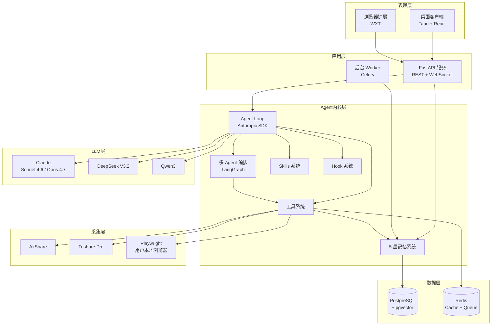
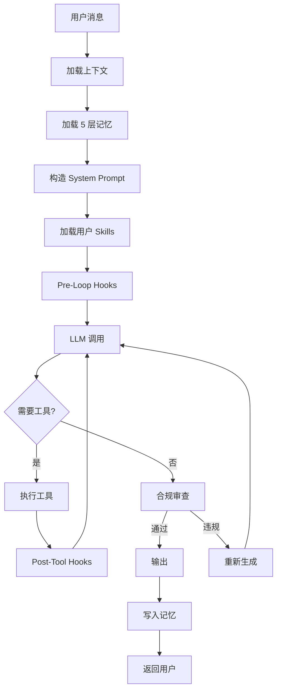
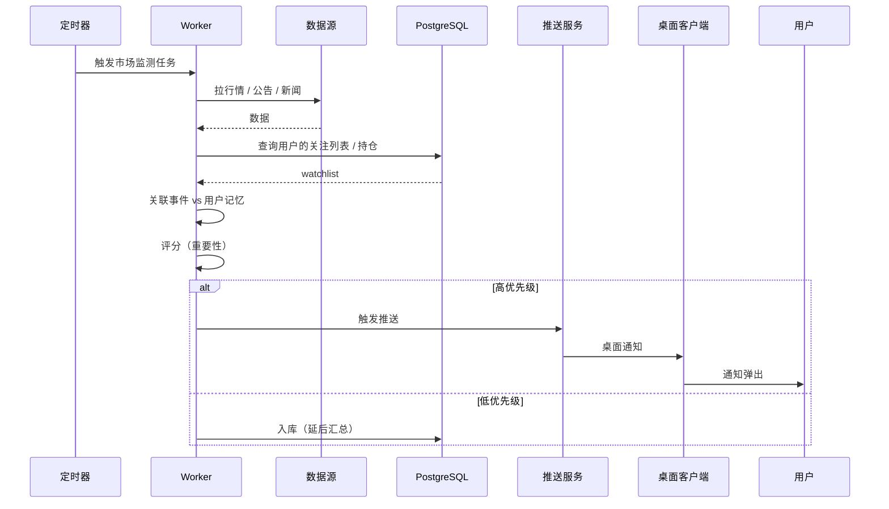
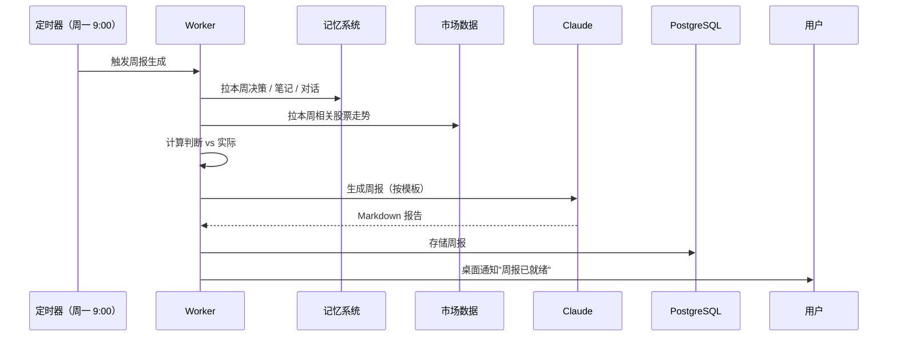

# TradeNest 架构设计

> 整体架构 + 模块划分 + 数据流。
>
> Version 1.0 · 2026-05-13

---

## 目录

- [1. 架构总览](#1-架构总览)
- [2. 分层设计](#2-分层设计)
- [3. 模块划分](#3-模块划分)
- [4. Agent 内核架构](#4-agent-内核架构)
- [5. 数据流](#5-数据流)
- [6. 桌面客户端架构](#6-桌面客户端架构)
- [7. 浏览器扩展架构](#7-浏览器扩展架构)
- [8. 部署架构](#8-部署架构)
- [9. 性能与可观测性](#9-性能与可观测性)
- [10. 安全架构](#10-安全架构)

---

## 1. 架构总览

### 1.1 系统全景图



### 1.2 设计原则

#### 5 大架构原则

1. **本地优先（Local-First）**
   - 用户数据存本地
   - 离线可用核心功能
   - 云同步是可选项

2. **模块化（Modular）**
   - 6 大功能模块独立
   - 每个 Agent 独立可测试
   - 工具可插拔

3. **可观测（Observable）**
   - 每次 Agent 调用可追溯
   - OpenTelemetry trace 全链路
   - 用户可看到 AI 思考过程

4. **可解释（Explainable）**
   - 每个输出标明来源
   - 调用了哪些工具可见
   - 引用了哪些记忆可见

5. **可控（Controllable）**
   - 用户可中断 Agent
   - 用户可编辑各层记忆
   - 模型 / 数据源可切换

---

## 2. 分层设计

### 2.1 五层架构

```
┌──────────────────────────────────────────┐
│   Layer 1: 表现层（Presentation）          │
│   - 桌面客户端（Tauri）                    │
│   - 浏览器扩展（WXT）                      │
│   - 未来：移动端 / Web                     │
└──────────────────────────────────────────┘
                  ↕ HTTP/WS
┌──────────────────────────────────────────┐
│   Layer 2: 应用层（Application）           │
│   - FastAPI 路由                          │
│   - WebSocket 推流                        │
│   - SSE 事件流                             │
│   - 后台 Worker（Celery）                  │
└──────────────────────────────────────────┘
                  ↕ Python API
┌──────────────────────────────────────────┐
│   Layer 3: Agent 内核层（Domain）          │
│   - Agent Loop（Anthropic SDK）           │
│   - 多 Agent 编排（LangGraph）             │
│   - 工具系统 / 记忆系统 / Skills / Hooks   │
└──────────────────────────────────────────┘
                  ↕ Repository Pattern
┌──────────────────────────────────────────┐
│   Layer 4: 数据层（Persistence）           │
│   - PostgreSQL 16 + pgvector              │
│   - Redis 7（Cache + Queue）              │
│   - 文件存储（用户配置 / 报告导出）         │
└──────────────────────────────────────────┘
                  ↕ Adapter
┌──────────────────────────────────────────┐
│   Layer 5: 集成层（Integration）           │
│   - LLM Provider（Claude / DeepSeek / ...）│
│   - 数据源（AkShare / Tushare）            │
│   - 浏览器（Playwright）                   │
└──────────────────────────────────────────┘
```

### 2.2 各层职责

#### Layer 1: 表现层

- **职责**：用户交互、对话渲染、图表展示
- **不做**：业务逻辑、数据持久化、LLM 调用
- **技术**：React 19 + TypeScript + shadcn/ui + Tailwind

#### Layer 2: 应用层

- **职责**：路由、鉴权、会话管理、长连接、任务调度
- **不做**：核心 Agent 逻辑（委托 Layer 3）
- **技术**：FastAPI + Pydantic + Celery

#### Layer 3: Agent 内核层（核心）

- **职责**：Agent 编排、工具调用、记忆管理、模型路由
- **技术**：Anthropic SDK + LangGraph + 自定义 Memory / Skills / Hooks

#### Layer 4: 数据层

- **职责**：数据持久化、查询优化、向量检索
- **技术**：SQLAlchemy + asyncpg + pgvector + redis-py

#### Layer 5: 集成层

- **职责**：外部系统适配、错误重试、降级
- **技术**：anthropic / openai / akshare / playwright SDKs

---

## 3. 模块划分

### 3.1 10 个核心模块

```
packages/server/tradenest/
├── api/              # 模块 1: API 路由
├── core/             # 模块 2: 核心配置 / 启动
├── agents/           # 模块 3: Agent 内核
├── memory/           # 模块 4: 5 层记忆
├── tools/            # 模块 5: 工具系统
├── data/             # 模块 6: 数据源
├── llm/              # 模块 7: LLM 适配
├── workers/          # 模块 8: 后台 Worker
├── compliance/       # 模块 9: 合规审查
└── observability/    # 模块 10: 可观测性
```

### 3.2 模块详述

#### 模块 1: api/

```
api/
├── __init__.py
├── routes/
│   ├── chat.py           # 对话路由
│   ├── memory.py         # 记忆 CRUD
│   ├── analysis.py       # 触发分析
│   ├── reports.py        # 复盘报告
│   ├── alerts.py         # 推送
│   └── admin.py          # 管理
├── deps.py               # 依赖注入
├── middleware/
│   ├── compliance.py     # 输出审查
│   └── auth.py
└── schemas/              # Pydantic 模型
```

**职责**：HTTP 接口、WebSocket、参数校验、响应格式化。

#### 模块 2: core/

```
core/
├── config.py            # Settings（pydantic-settings）
├── lifespan.py          # FastAPI 启动 / 关闭
├── db.py                # 数据库连接
├── redis.py             # Redis 连接
└── logging.py           # 结构化日志
```

#### 模块 3: agents/

```
agents/
├── runtime/
│   ├── loop.py          # Agent loop
│   ├── orchestrator.py  # 多 Agent 编排
│   └── state.py         # LangGraph 状态
├── analysts/
│   ├── market.py
│   ├── fundamentals.py
│   ├── news.py
│   ├── social.py
│   └── china_specific.py
├── researchers/
│   ├── bull.py
│   └── bear.py
├── risk_raters/
│   ├── aggressive.py
│   ├── conservative.py
│   └── neutral.py
├── synthesizer.py
├── socratic.py          # 苏格拉底反问 Agent
└── prompts/             # 所有 system prompt
    ├── analyst_base.md
    ├── researcher_base.md
    └── ...
```

详见 [AGENT-DESIGN.md](./0008-Agent设计.md)。

#### 模块 4: memory/

```
memory/
├── layers/
│   ├── l1_profile.py        # 用户画像
│   ├── l2_framework.py      # 研究框架
│   ├── l3_notes.py          # 研究笔记
│   ├── l4_decisions.py      # 决策档案
│   └── l5_conversations.py  # 对话历史
├── retrieval/
│   ├── vector.py            # 向量检索
│   ├── keyword.py           # 关键字检索
│   └── hybrid.py            # 混合检索
├── compaction/
│   ├── summarizer.py        # 对话压缩
│   └── snip.py              # 片段提取
└── importer/
    ├── notion.py
    ├── evernote.py
    └── markdown.py
```

详见 [DATA-MODEL.md](./0007-数据模型.md)。

#### 模块 5: tools/

```
tools/
├── registry.py              # 工具注册中心
├── base.py                  # Tool 基类
├── market/                  # 市场数据工具
│   ├── realtime_quote.py
│   ├── history_kline.py
│   ├── basic_info.py
│   └── financial_report.py
├── news/                    # 新闻 / 公告 / 研报
│   ├── announcements.py
│   ├── news.py
│   └── research_reports.py
├── memory/                  # 用户记忆操作
│   ├── search_notes.py
│   ├── save_note.py
│   ├── search_decisions.py
│   └── save_decision.py
├── browser/                 # Playwright 抓取
│   ├── xueqiu.py
│   ├── wechat.py
│   └── zhihu.py
└── web/                     # 通用搜索
    └── search.py
```

详见 [AGENT-DESIGN.md §3](./AGENT-DESIGN.md#3-工具系统)。

#### 模块 6: data/

```
data/
├── sources/
│   ├── akshare_provider.py
│   ├── tushare_provider.py
│   └── eastmoney_provider.py
├── browser/
│   ├── manager.py           # Playwright 管理
│   └── scrapers/
├── cache.py                 # Redis 缓存层
└── normalizer.py            # 数据归一化
```

#### 模块 7: llm/

```
llm/
├── providers/
│   ├── anthropic.py
│   ├── openai.py
│   ├── deepseek.py
│   ├── qwen.py
│   └── base.py
├── router.py                # 模型路由
├── retry.py                 # 重试 + 降级
└── tokens.py                # Token 计数
```

#### 模块 8: workers/

```
workers/
├── celery_app.py
├── tasks/
│   ├── market_monitor.py    # 实时市场监测
│   ├── alert_dispatcher.py  # 推送
│   ├── report_generator.py  # 复盘报告
│   ├── browser_scraper.py   # 后台抓取
│   └── memory_indexer.py    # 向量索引重建
└── schedules.py             # 定时任务
```

#### 模块 9: compliance/

```
compliance/
├── checker.py               # 输出审查
├── patterns.py              # 关键词黑名单
├── audit.py                 # 审计日志
└── disclaimer.py            # 免责声明模板
```

详见 [COMPLIANCE.md](./0002-合规边界.md)。

#### 模块 10: observability/

```
observability/
├── tracing.py               # OpenTelemetry
├── metrics.py               # Prometheus
├── logging.py               # 结构化日志
└── agent_recorder.py        # Agent 调用录像
```

---

## 4. Agent 内核架构

### 4.1 Agent Loop



### 4.2 工具系统

#### Tool 定义

```python
from typing import Protocol, Any
from pydantic import BaseModel

class ToolDefinition(BaseModel):
    name: str
    description: str
    input_schema: dict[str, Any]
    
class Tool(Protocol):
    definition: ToolDefinition
    
    async def execute(self, **kwargs: Any) -> str:
        ...
```

#### 注册机制

```python
# registry.py
class ToolRegistry:
    _tools: dict[str, Tool] = {}
    
    @classmethod
    def register(cls, tool: Tool) -> None:
        cls._tools[tool.definition.name] = tool
    
    @classmethod
    def get(cls, name: str) -> Tool:
        return cls._tools[name]
    
    @classmethod
    def all_definitions(cls) -> list[dict]:
        return [t.definition.dict() for t in cls._tools.values()]
```

#### 装饰器风格

```python
@register_tool
async def get_realtime_quote(code: str) -> str:
    """获取指定 A 股的实时行情。"""
    # 实现
    ...
```

### 4.3 记忆系统

详见 [DATA-MODEL.md §2](./DATA-MODEL.md#2-五层记忆详细设计)。

#### 加载策略

```python
async def build_context(user_query: str) -> Context:
    return Context(
        l1_profile=await load_user_profile(),                    # 总是加载
        l2_framework=await load_active_framework(),              # 总是加载
        l3_notes=await retrieve_relevant_notes(user_query, k=5), # 检索 top-k
        l4_decisions=await retrieve_relevant_decisions(user_query, k=3),
        l5_recent_conversations=await load_recent_summaries(n=3),
    )
```

#### 写入策略

- **L3 笔记**：用户主动 / AI 生成后用户确认
- **L4 决策**：用户主动记录决策时
- **L5 对话**：每次对话自动入库 + 周期性摘要

### 4.4 Skills 系统

借鉴 OpenClaw 的 Skills 设计。

#### Skill 定义

```yaml
# skills/value_investing.yaml
name: 价值投资风格
version: 1.0
applies_to:
  - analysis
  - research_note

system_prompt_addition: |
  当用户使用价值投资 Skill 时，必须：
  - 强调 ROIC / 自由现金流 / 护城河
  - 用 DCF / PE / PB 对估值
  - 关注长期持有视角
  
tools_priority:
  - get_financial_report
  - get_history_kline_long_term
  
output_template: |
  ## 商业分析
  ...
  ## 估值
  ...
  ## 风险
  ...
```

#### 加载机制

用户在对话中可以：
- 显式：`/skill value_investing`
- 隐式：AI 检测意图后建议加载

详见 [AGENT-DESIGN.md §5](./AGENT-DESIGN.md#5-skills-系统借鉴-openclaw)。

### 4.5 Hook 系统

借鉴 Claude Code 的 Hook 机制。

#### Hook 类型

```python
class HookKind(Enum):
    PRE_LOOP = "pre_loop"
    POST_LOOP = "post_loop"
    PRE_TOOL_CALL = "pre_tool_call"
    POST_TOOL_CALL = "post_tool_call"
    PRE_COMPACT = "pre_compact"
    POST_COMPACT = "post_compact"
    PRE_DECISION = "pre_decision"      # TradeNest 特有
    POST_OUTPUT = "post_output"
```

#### 决策前 Hook（关键设计）

```python
@hook(HookKind.PRE_DECISION)
async def socratic_check(decision_intent: DecisionIntent) -> HookResult:
    """用户表达决策意向时，强制反问。"""
    related = await search_related_decisions(decision_intent)
    contradictions = find_contradictions(decision_intent, related)
    if contradictions:
        return HookResult(
            action="inject",
            content=f"⚠️ 反问：{format_contradictions(contradictions)}",
        )
    return HookResult(action="continue")
```

详见 [AGENT-DESIGN.md §6](./AGENT-DESIGN.md#6-hook-系统借鉴-claude-code)。

---

## 5. 数据流

### 5.1 用户提问流程

```mermaid
sequenceDiagram
    participant U as 用户
    participant D as 桌面客户端
    participant API as FastAPI
    participant Loop as Agent Loop
    participant Mem as 记忆系统
    participant Tool as 工具
    participant LLM as Claude
    participant DB as PostgreSQL
    
    U->>D: 分析下贵州茅台
    D->>API: POST /chat (WebSocket)
    API->>Loop: 启动 Agent Run
    
    Loop->>Mem: 加载 L1 + L2 + L3 + L4 + L5
    Mem->>DB: 查询
    DB-->>Mem: 返回记忆
    Mem-->>Loop: 构造 Context
    
    Loop->>LLM: 第一次调用（带 Context）
    LLM-->>Loop: 决定调用 get_realtime_quote
    
    Loop->>Tool: get_realtime_quote(600519)
    Tool->>API: 调用 AkShare
    API-->>Tool: 行情数据
    Tool-->>Loop: 工具结果
    
    Loop->>LLM: 第二次调用（带工具结果）
    LLM-->>Loop: 输出分析报告
    
    Loop->>Loop: 合规审查
    Loop->>Mem: 存储新对话 / 笔记
    Mem->>DB: INSERT
    
    Loop-->>API: 流式输出
    API-->>D: SSE 推流
    D-->>U: 渲染
```

### 5.2 主动推送流程



### 5.3 复盘报告生成流程



---

## 6. 桌面客户端架构

### 6.1 Tauri 进程模型

```
┌─────────────────────────────────────────┐
│       Tauri Main Process (Rust)         │
│  - 系统托盘                              │
│  - 通知                                  │
│  - 文件系统                              │
│  - 配置管理                              │
│  - 后端进程管理（启动 / 停止）           │
└────────────┬────────────────────────────┘
             ↕ IPC (commands / events)
┌─────────────────────────────────────────┐
│       Renderer Process (WebView)        │
│  - React 19 + TypeScript                │
│  - 对话界面                              │
│  - 图表渲染                              │
│  - 与后端 API 通信（HTTP / WS）          │
└─────────────────────────────────────────┘
```

### 6.2 主进程职责

```rust
// src-tauri/src/main.rs（伪代码）
fn main() {
    tauri::Builder::default()
        .invoke_handler(tauri::generate_handler![
            start_backend,
            stop_backend,
            get_config,
            save_config,
            open_external_url,
        ])
        .system_tray(create_tray())
        .on_system_tray_event(handle_tray_event)
        .run(tauri::generate_context!())
        .expect("error while running tradenest");
}
```

### 6.3 渲染进程结构

```
apps/desktop/src/
├── main.tsx
├── App.tsx
├── routes/
│   ├── chat/
│   ├── notes/
│   ├── decisions/
│   ├── reports/
│   └── settings/
├── components/
│   ├── chat/
│   ├── memory/
│   ├── charts/    # TradingView Lightweight Charts
│   └── ui/        # shadcn
├── stores/        # Zustand
├── hooks/
├── api/           # 后端 API 客户端
└── types/
```

### 6.4 状态管理

```typescript
// stores/chatStore.ts
import { create } from 'zustand';

interface ChatStore {
  conversations: Conversation[];
  currentConversation: Conversation | null;
  sendMessage: (text: string) => Promise<void>;
  loadConversation: (id: string) => Promise<void>;
}

export const useChatStore = create<ChatStore>((set, get) => ({
  conversations: [],
  currentConversation: null,
  sendMessage: async (text) => { /* WebSocket */ },
  loadConversation: async (id) => { /* HTTP */ },
}));
```

---

## 7. 浏览器扩展架构

### 7.1 WXT 项目结构

```
apps/extension/
├── wxt.config.ts
├── entrypoints/
│   ├── popup/         # 工具栏弹出
│   ├── background.ts  # 后台脚本
│   └── content.ts     # content script
├── components/
└── shared/
```

### 7.2 三种脚本职责

| 脚本 | 运行环境 | 职责 |
|------|---------|------|
| **popup** | 用户点击图标后 | UI 操作、设置 |
| **background** | 浏览器后台 | 跨标签消息、定时任务 |
| **content script** | 注入到页面 | 抓取页面、注入按钮 |

### 7.3 集成场景

#### 雪球页面

```typescript
// content.ts on xueqiu.com
const stockCode = extractStockCodeFromUrl();

// 注入"存为笔记"按钮
const btn = document.createElement('button');
btn.textContent = '🪺 存到 TradeNest';
btn.onclick = async () => {
  const content = extractMainContent();
  await fetch('http://localhost:8000/notes', {
    method: 'POST',
    body: JSON.stringify({ stock_code: stockCode, content }),
  });
};
document.querySelector('.stock-header')?.appendChild(btn);
```

#### 微信公众号页面

抓文章 → 提取标的 → 自动关联用户记忆。

---

## 8. 部署架构

### 8.1 本地开发

```yaml
# docker/docker-compose.dev.yml
services:
  postgres:
    image: pgvector/pgvector:pg16
    ports: ["5432:5432"]
    
  redis:
    image: redis:7-alpine
    ports: ["6379:6379"]
```

后端用 `uvicorn --reload` 跑。

桌面用 `pnpm tauri dev` 跑。

### 8.2 用户机器部署

#### 一键安装

```
用户下载安装包 (.dmg / .exe / .deb)
   ↓
Tauri 安装器解压
   ↓
后台进程：tradenest-backend.exe / tradenest-backend
   ↓
内嵌 SQLite （或自带 PG portable）
   ↓
首次启动引导
```

#### 数据库选择

- **简化版（v1）**：SQLite + sqlite-vec（无需用户装 PG）
- **完整版（v2）**：PostgreSQL（性能更好，但用户要装）

### 8.3 云端版（v2+ 考虑）

```
用户 → CDN → 负载均衡 → FastAPI 集群
                          ↓
                          PostgreSQL（托管）
                          Redis（托管）
                          S3（用户备份）
```

---

## 9. 性能与可观测性

### 9.1 OpenTelemetry 集成

```python
# observability/tracing.py
from opentelemetry import trace

tracer = trace.get_tracer("tradenest")

@tracer.start_as_current_span("agent_run")
async def run_agent(query: str):
    span = trace.get_current_span()
    span.set_attribute("query", query)
    # ...
```

### 9.2 Agent 调用录像

每次 Agent 运行**完整记录**：
- 输入消息
- 加载的记忆
- 调用的工具 + 输入 + 输出
- LLM 输入 + 输出
- 总耗时
- 总 Token 消耗
- 总成本

```sql
CREATE TABLE agent_runs (
    id UUID PRIMARY KEY,
    started_at TIMESTAMP,
    ended_at TIMESTAMP,
    user_query TEXT,
    final_output TEXT,
    total_tokens INTEGER,
    total_cost_usd NUMERIC,
    trace JSONB,           -- 完整调用链
    status TEXT,
    error_message TEXT
);
```

### 9.3 性能指标

| 指标 | 目标 | 监控 |
|------|------|------|
| 首字延迟（TTFT） | < 2s | Prometheus |
| 全链路延迟（多 Agent 分析） | < 60s | Prometheus |
| 数据库查询 P95 | < 50ms | PG slow query log |
| 工具调用 P95 | < 5s | OpenTelemetry |

### 9.4 错误处理

- LLM 超时 → 降级到备用模型
- 工具失败 → 重试 3 次 + 上下文降级
- 数据源失败 → 多源 fallback
- 数据库失败 → 优雅降级（仍可用本地缓存）

---

## 10. 安全架构

### 10.1 API Key 管理

- 用户的 LLM API Key **只存本地**
- 用 OS Keychain（Mac Keychain / Windows Credential Manager）
- 不通过网络传输
- 桌面客户端代为持有，后端不存

### 10.2 数据加密

#### 静态加密

- 用户配置：使用 OS 级加密
- 数据库：可选 PG 透明加密（v2）
- 备份文件：用户 passphrase 加密

#### 传输加密

- 桌面 ↔ 后端：HTTPS / WSS
- 后端 ↔ LLM：HTTPS
- 后端 ↔ 数据源：HTTPS

### 10.3 用户隔离

v1 是单用户产品（每个用户跑自己的实例），不存在跨用户问题。

v2 SaaS 时：
- 数据库行级安全（RLS）
- API key per user
- Session 隔离

### 10.4 浏览器自动化安全

- Playwright 用用户本地 Chrome profile
- TradeNest 不存储用户登录态
- 抓取的内容 **本地展示**，**不上传共享**

详见 [COMPLIANCE.md](./0002-合规边界.md) §6 数据合规。

### 10.5 LLM 调用脱敏

```python
def sanitize_for_llm(text: str, profile: UserProfile) -> str:
    """LLM 调用前自动脱敏。"""
    text = text.replace(profile.real_name, "用户")
    text = re.sub(r"\d{18}", "[身份证]", text)
    text = re.sub(r"\d{16,19}", "[银行卡]", text)
    return text
```

---

## 11. 演进路径

### 11.1 v1 (Phase 4)

- 桌面客户端 + 浏览器扩展 + 本地后端
- 单用户、本地数据
- Apache 2.0 开源

### 11.2 v2

- 移动端
- 云同步（端到端加密）
- 多设备协作

### 11.3 v3

- SaaS 多用户版本
- 团队协作（一个研究员 + 助理共享笔记）
- API 对外（让其他工具集成）

---

🏗️ _好架构是渐进涌现的，不是一次设计的。_
