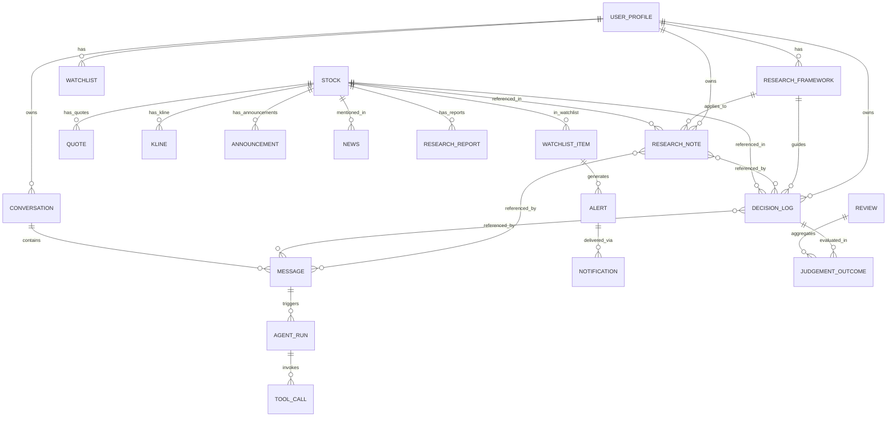

# TradeNest 数据模型

> 完整数据库设计：5 层记忆 + 市场数据 + Agent 运行 + 推送 + 复盘。
>
> Version 1.0 · 2026-05-13

---

## 目录

- [1. 数据模型总览](#1-数据模型总览)
- [2. 五层记忆详细设计](#2-五层记忆详细设计)
- [3. 市场数据模型](#3-市场数据模型)
- [4. Agent 运行数据](#4-agent-运行数据)
- [5. 推送与提醒](#5-推送与提醒)
- [6. 复盘数据](#6-复盘数据)
- [7. 索引设计](#7-索引设计)
- [8. 向量索引选型](#8-向量索引选型)
- [9. 分区策略](#9-分区策略)
- [10. SQL DDL](#10-sql-ddl)
- [11. 数据迁移策略](#11-数据迁移策略)

---

## 1. 数据模型总览

### 1.1 ER 关系图



### 1.2 表清单

```
五层记忆（用户数据）：
  - user_profile
  - research_framework
  - research_note
  - decision_log
  - conversation
  - message

市场数据（共享）：
  - stock
  - quote
  - kline
  - announcement
  - news
  - research_report

Agent 运行：
  - agent_run
  - tool_call

推送与监测：
  - watchlist_item
  - alert
  - notification

复盘：
  - review
  - judgement_outcome

系统：
  - schema_version（Alembic）
  - audit_log（合规审计）
```

---

## 2. 五层记忆详细设计

### 2.1 L1: user_profile

#### 字段

| 字段 | 类型 | 约束 | 说明 |
|------|------|------|------|
| id | UUID | PK | |
| version | INTEGER | NOT NULL | 版本号 |
| identity | JSONB | NOT NULL | name / age / occupation |
| investment_style | JSONB | NOT NULL | primary / secondary |
| risk_preference | JSONB | NOT NULL | max_drawdown / position_concentration |
| capability_circle | JSONB | NOT NULL | strong / learning / avoid |
| constraints | JSONB | NOT NULL | capital_size / liquidity / horizon / accounts |
| language | JSONB | NOT NULL | preferred / technical_level |
| extra | JSONB | | 用户自定义字段 |
| created_at | TIMESTAMPTZ | DEFAULT NOW() | |
| updated_at | TIMESTAMPTZ | DEFAULT NOW() | |

#### DDL

```sql
CREATE TABLE user_profile (
    id UUID PRIMARY KEY DEFAULT gen_random_uuid(),
    version INTEGER NOT NULL DEFAULT 1,
    identity JSONB NOT NULL,
    investment_style JSONB NOT NULL,
    risk_preference JSONB NOT NULL,
    capability_circle JSONB NOT NULL,
    constraints JSONB NOT NULL,
    language JSONB NOT NULL,
    extra JSONB,
    created_at TIMESTAMPTZ NOT NULL DEFAULT NOW(),
    updated_at TIMESTAMPTZ NOT NULL DEFAULT NOW()
);

-- v1 是单用户，但保留多用户结构（v2 扩展）
CREATE UNIQUE INDEX idx_user_profile_active ON user_profile(version);
```

#### 示例

```json
{
  "version": 1,
  "identity": {
    "name": "王明",
    "age": 35,
    "occupation": "软件工程师"
  },
  "investment_style": {
    "primary": "价值成长",
    "secondary": "行业轮动"
  },
  "risk_preference": {
    "max_drawdown": 0.30,
    "position_concentration": 0.30
  },
  "capability_circle": {
    "strong": ["互联网", "消费品", "半导体"],
    "learning": ["医药", "新能源"],
    "avoid": ["周期股", "衍生品"]
  },
  "constraints": {
    "capital_size_range": "100-500万",
    "liquidity_need": "low",
    "time_horizon": "3-5年",
    "account_types": ["A股", "港股", "美股"]
  },
  "language": {
    "preferred": "zh-CN",
    "technical_level": "high"
  }
}
```

### 2.2 L2: research_framework

#### 字段

| 字段 | 类型 | 约束 | 说明 |
|------|------|------|------|
| id | UUID | PK | |
| name | TEXT | NOT NULL | 框架名称 |
| version | TEXT | NOT NULL | 用户的版本号（v1.0/v2.1）|
| is_active | BOOLEAN | NOT NULL | 是否当前生效 |
| description | TEXT | | 框架描述 |
| checklist | JSONB | NOT NULL | 检查项清单（含权重） |
| deal_breakers | JSONB | NOT NULL | 一票否决项 |
| position_sizing_rules | JSONB | NOT NULL | 仓位规则 |
| created_at | TIMESTAMPTZ | DEFAULT NOW() | |
| updated_at | TIMESTAMPTZ | DEFAULT NOW() | |

#### DDL

```sql
CREATE TABLE research_framework (
    id UUID PRIMARY KEY DEFAULT gen_random_uuid(),
    name TEXT NOT NULL,
    version TEXT NOT NULL,
    is_active BOOLEAN NOT NULL DEFAULT FALSE,
    description TEXT,
    checklist JSONB NOT NULL,
    deal_breakers JSONB NOT NULL,
    position_sizing_rules JSONB NOT NULL,
    created_at TIMESTAMPTZ NOT NULL DEFAULT NOW(),
    updated_at TIMESTAMPTZ NOT NULL DEFAULT NOW()
);

CREATE UNIQUE INDEX idx_framework_active ON research_framework(is_active) 
  WHERE is_active = TRUE;
```

只有 1 个 framework 可以 `is_active = TRUE`，其他都是历史版本。

#### 示例

```json
{
  "name": "价值成长综合框架",
  "version": "2.1",
  "is_active": true,
  "checklist": [
    {
      "id": "business_quality",
      "name": "生意属性",
      "weight": 0.25,
      "questions": [
        "ROIC > 15%?",
        "自由现金流/净利润 > 70%?",
        "护城河在哪?"
      ]
    },
    ...
  ],
  "deal_breakers": [
    "财务造假嫌疑",
    "主营业务持续亏损 > 3 年",
    "ROIC < 8%（除非转型期）"
  ],
  "position_sizing_rules": {
    "high_conviction": [0.05, 0.10],
    "medium": [0.03, 0.05],
    "exploratory": [0.01, 0.02]
  }
}
```

### 2.3 L3: research_note

#### 字段

| 字段 | 类型 | 约束 | 说明 |
|------|------|------|------|
| id | UUID | PK | |
| stock_code | TEXT | NOT NULL | 股票代码 |
| stock_name | TEXT | NOT NULL | 股票名称 |
| title | TEXT | NOT NULL | 笔记标题 |
| content | TEXT | NOT NULL | Markdown 正文 |
| tags | TEXT[] | | 标签 |
| source | TEXT | NOT NULL | manual/imported/ai_generated |
| source_url | TEXT | | 如果来自爬取 |
| framework_version | TEXT | | 用了哪个框架版本 |
| framework_outputs | JSONB | | 框架打分结果 |
| title_embedding | vector(1024) | | 标题向量 |
| content_embedding | vector(1024) | | 正文向量 |
| parent_note_id | UUID | FK | 引用关系 |
| created_at | TIMESTAMPTZ | DEFAULT NOW() | |
| updated_at | TIMESTAMPTZ | DEFAULT NOW() | |

#### DDL

```sql
CREATE TABLE research_note (
    id UUID PRIMARY KEY DEFAULT gen_random_uuid(),
    stock_code TEXT NOT NULL,
    stock_name TEXT NOT NULL,
    title TEXT NOT NULL,
    content TEXT NOT NULL,
    tags TEXT[] DEFAULT '{}',
    source TEXT NOT NULL CHECK (source IN ('manual','imported','ai_generated')),
    source_url TEXT,
    framework_version TEXT,
    framework_outputs JSONB,
    title_embedding vector(1024),
    content_embedding vector(1024),
    parent_note_id UUID REFERENCES research_note(id),
    created_at TIMESTAMPTZ NOT NULL DEFAULT NOW(),
    updated_at TIMESTAMPTZ NOT NULL DEFAULT NOW()
);

CREATE INDEX idx_note_stock ON research_note(stock_code);
CREATE INDEX idx_note_tags ON research_note USING GIN (tags);
CREATE INDEX idx_note_created ON research_note(created_at DESC);
CREATE INDEX idx_note_content_vec ON research_note 
  USING hnsw (content_embedding vector_cosine_ops);
CREATE INDEX idx_note_title_vec ON research_note 
  USING hnsw (title_embedding vector_cosine_ops);
```

### 2.4 L4: decision_log

#### 字段

| 字段 | 类型 | 约束 | 说明 |
|------|------|------|------|
| id | UUID | PK | |
| timestamp | TIMESTAMPTZ | NOT NULL | 决策时间 |
| action | TEXT | NOT NULL | buy/sell/hold/watch/skip |
| stock_code | TEXT | NOT NULL | |
| stock_name | TEXT | NOT NULL | |
| quantity | NUMERIC(20,4) | | 数量（手 / 股） |
| price | NUMERIC(20,4) | | 决策时价格 |
| reasoning | TEXT | NOT NULL | Markdown 详细理由 |
| framework_outputs | JSONB | | 框架打分 |
| related_note_ids | UUID[] | | 关联笔记 |
| triggered_by | TEXT | NOT NULL | manual/event_X/periodic_review |
| confidence_level | INTEGER | CHECK 1-5 | 自评信心 |
| actual_executed | BOOLEAN | DEFAULT FALSE | 是否实际执行 |
| execution_price | NUMERIC(20,4) | | 实际成交价 |
| execution_time | TIMESTAMPTZ | | 实际成交时间 |
| review_at | TIMESTAMPTZ | | 计划复盘时间 |
| actual_outcome | JSONB | | 实际结果 |
| lessons_learned | TEXT | | 用户反思 |
| reasoning_embedding | vector(1024) | | 理由向量 |
| created_at | TIMESTAMPTZ | DEFAULT NOW() | |

#### DDL

```sql
CREATE TABLE decision_log (
    id UUID PRIMARY KEY DEFAULT gen_random_uuid(),
    timestamp TIMESTAMPTZ NOT NULL,
    action TEXT NOT NULL CHECK (action IN ('buy','sell','hold','watch','skip')),
    stock_code TEXT NOT NULL,
    stock_name TEXT NOT NULL,
    quantity NUMERIC(20,4),
    price NUMERIC(20,4),
    reasoning TEXT NOT NULL,
    framework_outputs JSONB,
    related_note_ids UUID[] DEFAULT '{}',
    triggered_by TEXT NOT NULL,
    confidence_level INTEGER CHECK (confidence_level BETWEEN 1 AND 5),
    actual_executed BOOLEAN NOT NULL DEFAULT FALSE,
    execution_price NUMERIC(20,4),
    execution_time TIMESTAMPTZ,
    review_at TIMESTAMPTZ,
    actual_outcome JSONB,
    lessons_learned TEXT,
    reasoning_embedding vector(1024),
    created_at TIMESTAMPTZ NOT NULL DEFAULT NOW()
);

CREATE INDEX idx_decision_stock ON decision_log(stock_code);
CREATE INDEX idx_decision_timestamp ON decision_log(timestamp DESC);
CREATE INDEX idx_decision_review ON decision_log(review_at) 
  WHERE review_at IS NOT NULL;
CREATE INDEX idx_decision_reasoning_vec ON decision_log 
  USING hnsw (reasoning_embedding vector_cosine_ops);
```

#### 关键设计：决策不一定对应交易

action 包含 `watch` 和 `skip` —— 这是**非交易决策**，但有研究价值。

### 2.5 L5: conversation + message

#### conversation 表

```sql
CREATE TABLE conversation (
    id UUID PRIMARY KEY DEFAULT gen_random_uuid(),
    title TEXT,
    started_at TIMESTAMPTZ NOT NULL DEFAULT NOW(),
    last_message_at TIMESTAMPTZ NOT NULL DEFAULT NOW(),
    tags TEXT[] DEFAULT '{}',
    related_stock_codes TEXT[] DEFAULT '{}',
    summary TEXT,
    summary_embedding vector(1024),
    is_archived BOOLEAN NOT NULL DEFAULT FALSE,
    metadata JSONB
);

CREATE INDEX idx_conv_last_message ON conversation(last_message_at DESC);
CREATE INDEX idx_conv_tags ON conversation USING GIN (tags);
CREATE INDEX idx_conv_stocks ON conversation USING GIN (related_stock_codes);
CREATE INDEX idx_conv_summary_vec ON conversation 
  USING hnsw (summary_embedding vector_cosine_ops);
```

#### message 表

```sql
CREATE TABLE message (
    id UUID PRIMARY KEY DEFAULT gen_random_uuid(),
    conversation_id UUID NOT NULL REFERENCES conversation(id) ON DELETE CASCADE,
    timestamp TIMESTAMPTZ NOT NULL DEFAULT NOW(),
    role TEXT NOT NULL CHECK (role IN ('user','assistant','tool','system')),
    content TEXT NOT NULL,
    
    -- 工具调用
    tool_calls JSONB,
    tool_results JSONB,
    
    -- 引用
    referenced_note_ids UUID[] DEFAULT '{}',
    referenced_decision_ids UUID[] DEFAULT '{}',
    
    -- 压缩相关
    importance_score FLOAT CHECK (importance_score BETWEEN 0 AND 1),
    is_summarized BOOLEAN NOT NULL DEFAULT FALSE,
    summary_replaced_by UUID,  -- 如被压缩，指向新摘要消息
    
    -- 元数据
    model_used TEXT,
    token_count INTEGER,
    
    metadata JSONB
);

CREATE INDEX idx_msg_conv_time ON message(conversation_id, timestamp);
CREATE INDEX idx_msg_role ON message(conversation_id, role);
```

---

## 3. 市场数据模型

### 3.1 stock（股票主数据）

```sql
CREATE TABLE stock (
    code TEXT PRIMARY KEY,                  -- 600519 / 00700 / AAPL
    market TEXT NOT NULL,                   -- A_SH / A_SZ / HK / US
    name TEXT NOT NULL,
    name_en TEXT,
    industry_l1 TEXT,                       -- 一级行业
    industry_l2 TEXT,                       -- 二级行业
    listing_date DATE,
    is_delisted BOOLEAN NOT NULL DEFAULT FALSE,
    metadata JSONB,
    updated_at TIMESTAMPTZ NOT NULL DEFAULT NOW()
);

CREATE INDEX idx_stock_market ON stock(market);
CREATE INDEX idx_stock_industry ON stock(industry_l1, industry_l2);
CREATE INDEX idx_stock_name ON stock(name);
```

### 3.2 quote（实时行情）

```sql
CREATE TABLE quote (
    id BIGSERIAL PRIMARY KEY,
    stock_code TEXT NOT NULL REFERENCES stock(code),
    timestamp TIMESTAMPTZ NOT NULL,
    open NUMERIC(20,4),
    high NUMERIC(20,4),
    low NUMERIC(20,4),
    close NUMERIC(20,4),
    volume BIGINT,
    turnover NUMERIC(20,2),
    bid_ask JSONB,                          -- 买卖五档
    extra JSONB                             -- 涨跌停 / 停牌等
) PARTITION BY RANGE (timestamp);

CREATE INDEX idx_quote_stock_time ON quote(stock_code, timestamp DESC);
```

实时行情不必持久化全量（可在 Redis 做热数据缓存，PG 仅留快照）。

### 3.3 kline（K 线）

```sql
CREATE TABLE kline (
    stock_code TEXT NOT NULL REFERENCES stock(code),
    period TEXT NOT NULL,                   -- 1m/5m/15m/30m/1h/1d/1w/1M
    timestamp TIMESTAMPTZ NOT NULL,
    open NUMERIC(20,4),
    high NUMERIC(20,4),
    low NUMERIC(20,4),
    close NUMERIC(20,4),
    volume BIGINT,
    turnover NUMERIC(20,2),
    indicators JSONB,                       -- MA / MACD / RSI 等预算
    PRIMARY KEY (stock_code, period, timestamp)
) PARTITION BY RANGE (timestamp);

CREATE INDEX idx_kline_stock_period ON kline(stock_code, period, timestamp DESC);
```

### 3.4 announcement（公告）

```sql
CREATE TABLE announcement (
    id UUID PRIMARY KEY DEFAULT gen_random_uuid(),
    stock_code TEXT NOT NULL REFERENCES stock(code),
    publish_time TIMESTAMPTZ NOT NULL,
    title TEXT NOT NULL,
    content TEXT,
    pdf_url TEXT,
    category TEXT,                          -- 财报/分红/重组等
    importance INTEGER CHECK (importance BETWEEN 1 AND 5),
    content_embedding vector(1024),
    raw_data JSONB
);

CREATE INDEX idx_ann_stock ON announcement(stock_code, publish_time DESC);
CREATE INDEX idx_ann_category ON announcement(category);
CREATE INDEX idx_ann_content_vec ON announcement 
  USING hnsw (content_embedding vector_cosine_ops);
```

### 3.5 news（新闻）

```sql
CREATE TABLE news (
    id UUID PRIMARY KEY DEFAULT gen_random_uuid(),
    publish_time TIMESTAMPTZ NOT NULL,
    title TEXT NOT NULL,
    content TEXT,
    source TEXT NOT NULL,
    source_url TEXT NOT NULL,
    related_stock_codes TEXT[] DEFAULT '{}',
    sentiment FLOAT,                        -- -1 ~ 1
    content_embedding vector(1024),
    raw_data JSONB
);

CREATE INDEX idx_news_time ON news(publish_time DESC);
CREATE INDEX idx_news_stocks ON news USING GIN (related_stock_codes);
CREATE INDEX idx_news_content_vec ON news 
  USING hnsw (content_embedding vector_cosine_ops);
CREATE UNIQUE INDEX idx_news_url ON news(source_url);
```

### 3.6 research_report（研报）

```sql
CREATE TABLE research_report (
    id UUID PRIMARY KEY DEFAULT gen_random_uuid(),
    stock_code TEXT NOT NULL REFERENCES stock(code),
    publish_date DATE NOT NULL,
    title TEXT NOT NULL,
    institution TEXT NOT NULL,              -- 中信/中金/海通...
    analyst TEXT,
    rating TEXT,                            -- 买入/增持/中性...
    target_price NUMERIC(20,4),             -- 注：仅记录，不展示给用户作建议
    summary TEXT,
    full_content TEXT,
    pdf_url TEXT,
    summary_embedding vector(1024)
);

CREATE INDEX idx_report_stock ON research_report(stock_code, publish_date DESC);
CREATE INDEX idx_report_inst ON research_report(institution);
CREATE INDEX idx_report_summary_vec ON research_report 
  USING hnsw (summary_embedding vector_cosine_ops);
```

⚠️ 注：`target_price` 是机构研报的字段，**仅作信息记录**，TradeNest **不主动展示给用户作为建议**。

---

## 4. Agent 运行数据

### 4.1 agent_run

```sql
CREATE TABLE agent_run (
    id UUID PRIMARY KEY DEFAULT gen_random_uuid(),
    triggered_by_message_id UUID REFERENCES message(id),
    user_query TEXT NOT NULL,
    started_at TIMESTAMPTZ NOT NULL DEFAULT NOW(),
    ended_at TIMESTAMPTZ,
    status TEXT NOT NULL CHECK (status IN ('running','completed','failed','cancelled')),
    error_message TEXT,
    
    -- Agent 类型
    agent_type TEXT NOT NULL,               -- single/multi_agent/socratic/...
    
    -- 输入输出
    input_context JSONB,                    -- 加载了哪些记忆
    final_output TEXT,
    
    -- 性能
    total_tokens_input INTEGER,
    total_tokens_output INTEGER,
    total_cost_usd NUMERIC(10,6),
    
    -- 完整 trace
    trace JSONB,
    
    -- 合规
    compliance_check_passed BOOLEAN,
    compliance_violations JSONB
);

CREATE INDEX idx_run_started ON agent_run(started_at DESC);
CREATE INDEX idx_run_status ON agent_run(status);
```

### 4.2 tool_call

```sql
CREATE TABLE tool_call (
    id UUID PRIMARY KEY DEFAULT gen_random_uuid(),
    agent_run_id UUID NOT NULL REFERENCES agent_run(id) ON DELETE CASCADE,
    tool_name TEXT NOT NULL,
    input JSONB NOT NULL,
    output JSONB,
    started_at TIMESTAMPTZ NOT NULL DEFAULT NOW(),
    ended_at TIMESTAMPTZ,
    duration_ms INTEGER,
    status TEXT NOT NULL CHECK (status IN ('success','error','timeout')),
    error_message TEXT
);

CREATE INDEX idx_tool_call_run ON tool_call(agent_run_id);
CREATE INDEX idx_tool_call_name ON tool_call(tool_name);
```

---

## 5. 推送与提醒

### 5.1 watchlist_item

```sql
CREATE TABLE watchlist_item (
    id UUID PRIMARY KEY DEFAULT gen_random_uuid(),
    stock_code TEXT NOT NULL REFERENCES stock(code),
    added_at TIMESTAMPTZ NOT NULL DEFAULT NOW(),
    note TEXT,
    
    -- 触发规则
    alert_rules JSONB,                      -- 用户配置的提醒条件
    
    UNIQUE(stock_code)
);
```

### 5.2 alert（系统监测到的事件）

```sql
CREATE TABLE alert (
    id UUID PRIMARY KEY DEFAULT gen_random_uuid(),
    triggered_at TIMESTAMPTZ NOT NULL DEFAULT NOW(),
    severity TEXT NOT NULL CHECK (severity IN ('P0','P1','P2','P3')),
    type TEXT NOT NULL,                     -- price_alert/announcement/news/...
    stock_code TEXT REFERENCES stock(code),
    title TEXT NOT NULL,
    content TEXT,
    
    -- 上下文
    related_event_id UUID,                  -- 引用 announcement / news 等
    related_note_ids UUID[],
    related_decision_ids UUID[],
    
    -- 状态
    delivered BOOLEAN NOT NULL DEFAULT FALSE,
    read BOOLEAN NOT NULL DEFAULT FALSE,
    dismissed BOOLEAN NOT NULL DEFAULT FALSE,
    
    metadata JSONB
);

CREATE INDEX idx_alert_triggered ON alert(triggered_at DESC);
CREATE INDEX idx_alert_severity ON alert(severity);
CREATE INDEX idx_alert_unread ON alert(read) WHERE read = FALSE;
```

### 5.3 notification（推送渠道）

```sql
CREATE TABLE notification (
    id UUID PRIMARY KEY DEFAULT gen_random_uuid(),
    alert_id UUID NOT NULL REFERENCES alert(id) ON DELETE CASCADE,
    channel TEXT NOT NULL,                  -- desktop/email/inbox
    sent_at TIMESTAMPTZ NOT NULL DEFAULT NOW(),
    success BOOLEAN NOT NULL,
    error_message TEXT
);
```

---

## 6. 复盘数据

### 6.1 review

```sql
CREATE TABLE review (
    id UUID PRIMARY KEY DEFAULT gen_random_uuid(),
    period TEXT NOT NULL CHECK (period IN ('weekly','monthly','yearly')),
    period_start DATE NOT NULL,
    period_end DATE NOT NULL,
    generated_at TIMESTAMPTZ NOT NULL DEFAULT NOW(),
    
    -- 报告内容
    summary TEXT,
    content_md TEXT NOT NULL,
    metrics JSONB,                          -- 量化指标
    
    -- 用户反馈
    user_read BOOLEAN NOT NULL DEFAULT FALSE,
    user_notes TEXT,                        -- 用户自己的反思
    
    UNIQUE(period, period_start, period_end)
);

CREATE INDEX idx_review_period ON review(period, period_start DESC);
```

### 6.2 judgement_outcome（判断对照实际）

```sql
CREATE TABLE judgement_outcome (
    id UUID PRIMARY KEY DEFAULT gen_random_uuid(),
    decision_id UUID REFERENCES decision_log(id),
    note_id UUID REFERENCES research_note(id),
    
    judgement TEXT NOT NULL,                -- 用户当时的判断
    judgement_time TIMESTAMPTZ NOT NULL,
    
    -- 实际结果
    evaluated_at TIMESTAMPTZ NOT NULL DEFAULT NOW(),
    actual_data JSONB,                      -- 价格走势 / 实际财报 / etc.
    accuracy_score FLOAT,                   -- 0-1 准确度
    
    -- 关联到哪个 review
    review_id UUID REFERENCES review(id)
);

CREATE INDEX idx_judgement_review ON judgement_outcome(review_id);
```

---

## 7. 索引设计

### 7.1 索引原则

1. **查询频次高的字段**必加索引
2. **JOIN 字段**必加索引（外键）
3. **范围查询字段**（如时间戳）用 BTREE
4. **数组字段**（如 tags）用 GIN
5. **JSONB 字段**按需用 GIN
6. **向量字段**用 HNSW

### 7.2 关键索引清单

```sql
-- 用户记忆访问最频繁的索引
CREATE INDEX idx_note_stock ON research_note(stock_code);
CREATE INDEX idx_note_recent ON research_note(created_at DESC);
CREATE INDEX idx_decision_stock ON decision_log(stock_code);
CREATE INDEX idx_decision_review ON decision_log(review_at) WHERE review_at IS NOT NULL;
CREATE INDEX idx_msg_conv_time ON message(conversation_id, timestamp);

-- 向量索引（HNSW）
CREATE INDEX idx_note_vec ON research_note USING hnsw (content_embedding vector_cosine_ops);
CREATE INDEX idx_decision_vec ON decision_log USING hnsw (reasoning_embedding vector_cosine_ops);
CREATE INDEX idx_conv_vec ON conversation USING hnsw (summary_embedding vector_cosine_ops);

-- GIN 索引（数组 / JSONB）
CREATE INDEX idx_note_tags ON research_note USING GIN (tags);
CREATE INDEX idx_news_stocks ON news USING GIN (related_stock_codes);

-- 监测查询
CREATE INDEX idx_alert_unread ON alert(read) WHERE read = FALSE;
```

### 7.3 全文搜索（中文）

```sql
-- 用 pg_trgm 做模糊搜索
CREATE EXTENSION IF NOT EXISTS pg_trgm;

CREATE INDEX idx_note_title_trgm ON research_note USING GIN (title gin_trgm_ops);
CREATE INDEX idx_news_title_trgm ON news USING GIN (title gin_trgm_ops);

-- 复杂中文全文搜索可考虑 zhparser（PG 扩展），v2 再说
```

---

## 8. 向量索引选型

### 8.1 HNSW vs IVFFlat

| 维度 | HNSW | IVFFlat |
|------|------|---------|
| 精度 | 高 | 中 |
| 速度 | 快 | 中 |
| 索引构建时间 | 慢 | 快 |
| 内存占用 | 高 | 低 |
| 适用 | 数据稳定、查询多 | 大量数据 |

### 8.2 决策：默认 HNSW

理由：
- 数据规模小（个人项目，几万到几十万向量）
- 查询频繁（每次对话都检索）
- 精度比性能更重要

### 8.3 HNSW 参数

```sql
CREATE INDEX idx_note_vec ON research_note 
  USING hnsw (content_embedding vector_cosine_ops)
  WITH (m = 16, ef_construction = 64);
```

参数：
- `m = 16`：每个节点的连接数（默认 16，平衡）
- `ef_construction = 64`：构建时搜索深度（默认 64）
- 查询时 `ef_search` 可调

### 8.4 Embedding 模型选择

| 模型 | 维度 | 中文 | 价格 |
|------|------|------|------|
| **text-embedding-3-small** | 1536 | 中 | 极低 |
| **text-embedding-3-large** | 3072 | 中 | 低 |
| **bge-large-zh-v1.5** | 1024 | ✅ 强 | 自部署免费 |
| **m3e-large** | 1024 | ✅ 强 | 自部署免费 |
| **voyage-large-2** | 1536 | 一般 | 中 |

### 8.5 决策：bge-large-zh-v1.5（1024 维）

理由：
- 中文向量化最强
- 自部署免费（本地优先）
- 1024 维，存储成本可控
- 性能与精度平衡好

实施：
- v1: 用 `sentence-transformers` 本地跑
- 性能不够时考虑 OpenAI text-embedding-3 备选

---

## 9. 分区策略

### 9.1 时序数据分区

```sql
-- quote 按月分区
CREATE TABLE quote (
    -- ...同上
) PARTITION BY RANGE (timestamp);

CREATE TABLE quote_2026_05 PARTITION OF quote
  FOR VALUES FROM ('2026-05-01') TO ('2026-06-01');

CREATE TABLE quote_2026_06 PARTITION OF quote
  FOR VALUES FROM ('2026-06-01') TO ('2026-07-01');

-- 自动化建分区（用 pg_partman 或 cron）
```

### 9.2 K 线分区策略

- **1m / 5m**：按月分区，保留 6 月
- **1h / 1d**：不分区，保留全部

### 9.3 数据保留策略

| 表 | 保留期 |
|----|-------|
| quote | 6 个月 |
| kline 1m/5m | 6 个月 |
| kline 1h+ | 永久 |
| news | 2 年 |
| announcement | 永久 |
| agent_run trace | 1 年 |
| tool_call | 6 个月 |

用户记忆（L1-L5）**永久保留**。

---

## 10. SQL DDL

### 10.1 完整初始化脚本

详见仓库 `packages/server/migrations/001_initial.sql` 或 Alembic 自动生成。

### 10.2 扩展启用

```sql
-- 必装扩展
CREATE EXTENSION IF NOT EXISTS vector;        -- pgvector
CREATE EXTENSION IF NOT EXISTS pg_trgm;       -- 模糊搜索
CREATE EXTENSION IF NOT EXISTS uuid-ossp;     -- gen_random_uuid (PG13+ 内置)
CREATE EXTENSION IF NOT EXISTS pg_stat_statements; -- 性能监控
```

### 10.3 时区设置

```sql
SET TIME ZONE 'Asia/Shanghai';
```

---

## 11. 数据迁移策略

### 11.1 Alembic 工作流

```bash
# 创建迁移
uv run alembic revision --autogenerate -m "add user_profile"

# 检查生成的迁移文件
# packages/server/migrations/versions/xxx_add_user_profile.py

# 升级
uv run alembic upgrade head

# 回滚
uv run alembic downgrade -1
```

### 11.2 迁移命名规范

```
{version}_{description}.py
例：001_initial_schema.py
   002_add_research_framework.py
   003_add_vector_indexes.py
```

### 11.3 不可逆迁移的处理

某些迁移（如删除字段）需要：
1. **先发版本 N**：废弃字段（写入但不读）
2. **观察 1-2 个版本**：确认没人读
3. **版本 N+2**：删除字段

### 11.4 数据迁移 vs 模式迁移

- **模式迁移**：表结构变化（DDL）→ Alembic 处理
- **数据迁移**：数据形态变化 → 单独脚本

例如：从 `target_price NUMERIC` 迁移到 JSONB → 写 Python 脚本处理。

### 11.5 升级节奏

- **patch 版本**：可向后兼容的迁移
- **minor 版本**：可能含数据迁移，文档说明
- **major 版本**：可能含破坏性迁移，提供升级工具

---

## 12. 性能预估

### 12.1 数据量级（5 年后）

| 表 | 预估行数 | 大小估算 |
|----|---------|---------|
| user_profile | 1 | < 1 KB |
| research_framework | 5-10 | < 100 KB |
| research_note | 5,000-10,000 | 50 MB（含向量） |
| decision_log | 1,000-3,000 | 5 MB |
| conversation | 1,000-5,000 | 50 MB |
| message | 100,000-500,000 | 500 MB |
| stock | 5,000-10,000 | 5 MB |
| kline (1d) | 5,000 × 365 × 5 = 9M | 1 GB |
| announcement | 50,000+ | 200 MB |
| news | 1M+ | 5 GB |
| agent_run | 50,000 | 1 GB |

### 12.2 v1 个人项目

总体 < 10 GB，PG 16 单机性能完全够。

### 12.3 v2 SaaS 时考虑

- 共享市场数据（stock/quote/kline/news）单独库
- 用户数据按 tenant 切分
- 向量数据可能需要专用向量库（Milvus）

---

🗄️ _数据是产品的脊椎。设计错了，整个项目都站不直。_
