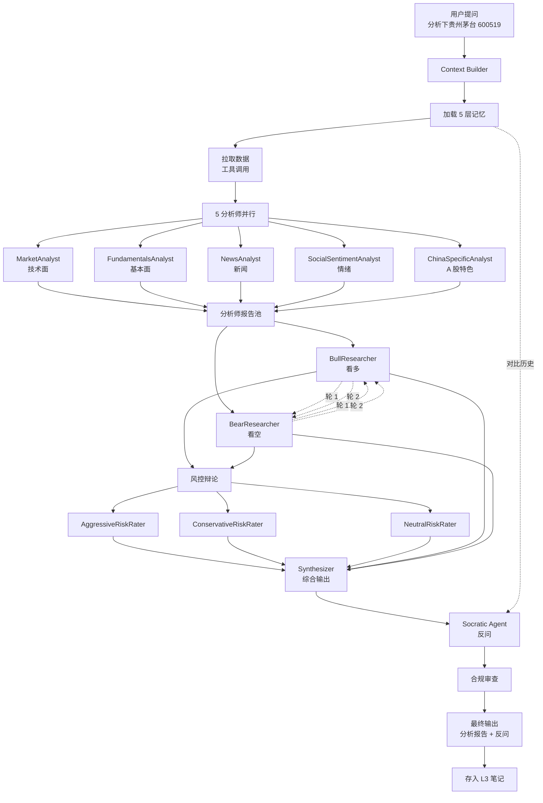
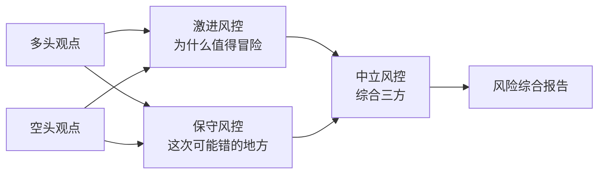

# TradeNest Agent 设计

> Agent 内核 / 多 Agent 编排 / 工具系统 / Skills / Hooks / 苏格拉底对话。
>
> Version 1.0 · 2026-05-13

---

## 目录

- [1. Agent 设计哲学](#1-agent-设计哲学)
- [2. 多 Agent 编排](#2-多-agent-编排)
- [3. 工具系统](#3-工具系统)
- [4. 记忆系统集成](#4-记忆系统集成)
- [5. Skills 系统（借鉴 OpenClaw）](#5-skills-系统借鉴-openclaw)
- [6. Hook 系统（借鉴 Claude Code）](#6-hook-系统借鉴-claude-code)
- [7. 上下文管理（5 层压缩）](#7-上下文管理5-层压缩)
- [8. Sub-agent 设计](#8-sub-agent-设计)
- [9. 苏格拉底对话策略](#9-苏格拉底对话策略)
- [10. 模型路由](#10-模型路由)
- [11. 评估与测试](#11-评估与测试)

---

## 1. Agent 设计哲学

### 1.1 三大原则

#### 原则 1：不替决策（Never Decide For User）

- ❌ AI 不说"建议买入"
- ❌ AI 不说"目标价 X 元"
- ✅ AI 整理事实
- ✅ AI 多视角分析
- ✅ AI 反问引导

#### 原则 2：苏格拉底式（Socratic）

- 问问题 > 给答案
- 让用户自己想清楚
- 价值在"过程"，不在"结论"

#### 原则 3：用户框架优先（User Framework First）

- 用户的 L2 研究框架是 AI 的"宪法"
- AI 必须按用户的框架结构化输出
- AI 不能违反用户的 deal_breakers

### 1.2 Agent 行为公约

每个 Agent 必须：

```yaml
must:
  - 遵守 COMPLIANCE.md 红线
  - 遵守用户的 L2 框架
  - 在输出末尾附上免责声明
  - 引用具体数据来源
  - 标明使用的工具

must_not:
  - 给具体买卖建议
  - 预测股价或目标价
  - 编造数据
  - 替用户决定
  - 跳过框架的 deal_breakers 检查
```

---

## 2. 多 Agent 编排

### 2.1 整体编排图



### 2.2 五分析师角色

#### 2.2.1 MarketAnalyst（技术面分析师）

**职责**：技术指标 / K 线形态 / 量价关系

**System Prompt 模板**：

```
你是 TradeNest 的技术面分析师 Agent。

【你的角色】
- 专注：K 线形态 / 技术指标（MA / MACD / RSI / KDJ） / 量价关系
- 不看：基本面 / 新闻 / 情绪
- 输出：客观技术信号

【你必须做的】
1. 检查关键技术指标
2. 识别 K 线形态
3. 量价关系判断
4. 标明指标的局限性

【你不能做的】
- ❌ 给"建议买入/卖出"
- ❌ 预测股价
- ❌ 给目标价
- ✅ 你只描述"技术信号是什么"

【输入】
- stock_code, period
- 历史 K 线数据
- 用户的 L1 / L2

【输出 JSON】
{
  "summary": "一句话总结技术面",
  "indicators": {
    "ma": {...},
    "macd": {...},
    "rsi": {...}
  },
  "patterns": [
    {"name": "...", "confidence": 0-1}
  ],
  "volume_price": {...},
  "limitations": ["技术分析的局限性"]
}
```

#### 2.2.2 FundamentalsAnalyst（基本面分析师）

**职责**：财报分析 / 商业模式 / 护城河 / 管理层

**System Prompt 模板**：

```
你是 TradeNest 的基本面分析师 Agent。

【你的角色】
- 专注：财务数据 / 商业模式 / 护城河 / 管理层
- 不看：技术面 / 短期情绪
- 输出：基于事实的判断（不是建议）

【你必须做的】
1. 检查最近 4 个季度财报
2. 同行业可比对比
3. 识别异常财务信号
4. 评估盈利质量
5. 严格按用户的 L2 框架输出

【你不能做的】
- ❌ 给买卖建议
- ❌ 预测股价
- ❌ 跳过 deal_breakers 检查

【输入】
- stock_code
- 财报数据
- 用户的 L2 框架

【输出 JSON】
{
  "summary": "一句话总结",
  "framework_score": {
    "business_quality": {"score": 0-100, "evidence": [...]},
    "growth_quality": {"score": 0-100, "evidence": [...]},
    "valuation": {"score": 0-100, "evidence": [...]},
    "management": {"score": 0-100, "evidence": [...]},
    "risk": {"score": 0-100, "evidence": [...]}
  },
  "deal_breakers_check": {
    "passed": true/false,
    "violations": [...]
  },
  "anomalies": [...]
}
```

#### 2.2.3 NewsAnalyst（新闻分析师）

**职责**：最近 30 天新闻 / 公告 / 重大事件

```yaml
关注：
- 财报披露
- 重大合同
- 高管变动
- 监管事件
- 行业政策

输出：
{
  "events": [
    {
      "date": "...",
      "title": "...",
      "category": "财报/合同/...",
      "impact_estimate": "高/中/低",
      "factual_impact": "事件本身的影响是什么（不预测股价）"
    }
  ],
  "summary": "..."
}
```

#### 2.2.4 SocialSentimentAnalyst（情绪分析师）

**职责**：雪球 / 知乎 / 微信公众号的市场情绪

```yaml
数据源：
- 雪球：股票讨论高赞
- 知乎：相关话题
- 微信公众号：相关文章

输出：
{
  "sentiment_distribution": {"bullish": 0.4, "bearish": 0.3, "neutral": 0.3},
  "trending_topics": [...],
  "notable_voices": [
    {"author": "...", "view": "...", "stance": "bullish/bearish"}
  ],
  "summary": "市场情绪偏..."
}
```

⚠️ 注：呈现情绪不等于推荐。

#### 2.2.5 ChinaSpecificAnalyst（A 股特色分析师）

**职责**：A 股特有信号

```yaml
关注：
- 北向资金（沪深港通）
- 龙虎榜
- 主力 / 大单 / 中单 / 散户
- 涨跌停
- ST / 退市风险
- 股东减持
- 解禁

输出：
{
  "northbound_flow": {...},
  "dragonHu_list": {...},
  "major_holder_changes": {...},
  "summary": "..."
}
```

### 2.3 多空辩论

#### 流程

```python
async def bull_bear_debate(
    analyst_reports: AnalystReports,
    user_context: Context,
    rounds: int = 2,
) -> DebateResult:
    bull_pos = await bull_initial_argument(analyst_reports, user_context)
    bear_pos = await bear_initial_argument(analyst_reports, user_context)
    
    for round_i in range(rounds):
        bull_pos = await bull_rebut(
            previous=bull_pos,
            opponent=bear_pos,
            evidence=analyst_reports,
        )
        bear_pos = await bear_rebut(
            previous=bear_pos,
            opponent=bull_pos,
            evidence=analyst_reports,
        )
    
    return DebateResult(
        bull_final=bull_pos,
        bear_final=bear_pos,
        rounds=rounds,
    )
```

#### 看多研究员（BullResearcher）

```
你是 TradeNest 的看多研究员。

【你的任务】
基于 5 分析师报告，构建**最强的看多论据**。
你不是"评估"，你是"代表多头"。

【规则】
1. 必须基于事实
2. 不能编造数据
3. 不出"建议买入"——而是"看多的核心理由"
4. 在反驳轮次中，必须直面对方的观点

【输出】
{
  "core_thesis": "看多的核心论点（一句话）",
  "supporting_evidence": [
    {"point": "...", "data": "..."}
  ],
  "rebuttal_to_bear": [
    {"bear_claim": "...", "my_rebuttal": "..."}  // 仅在第 2 轮+
  ]
}
```

#### 看空研究员（BearResearcher）

镜像设计，输出"看空的核心论据"。

### 2.4 三方风控辩论



#### 三方角色

```
AggressiveRiskRater：
  立场：如果用户冒险，最强的支持理由是什么
  输出：[3 个最有力的"值得冒险"理由]
  
ConservativeRiskRater：
  立场：如果用户保守，最强的支持理由是什么
  输出：[3 个最有力的"避免冒险"理由]
  
NeutralRiskRater：
  立场：综合双方，给出客观风险评估
  输出：综合风险等级 + 关键风险点
```

### 2.5 综合输出 Agent (Synthesizer)

**职责**：把以上所有 Agent 的输出**编织成一份报告**——但不是综合"建议"。

```
你是 TradeNest 的综合输出 Agent。

【你的任务】
把分析师 + 多空辩论 + 风控辩论的内容编织成一份报告。

【绝对禁止】
- ❌ 给最终结论"建议买入/卖出"
- ❌ 给目标价
- ❌ 综合 score 评级（如 "评级：买入"）
- ❌ 选边

【必须做】
- ✅ 客观呈现各方观点
- ✅ 对比用户的历史研究
- ✅ 列出关键决策因素
- ✅ 末尾包含反问

【输出格式】
Markdown，按 [PRD §7.6](./PRD.md#76-输出格式) 结构。
```

---

## 3. 工具系统

### 3.1 工具清单（v1 至少 15 个）

#### 市场数据工具

| 工具 | 输入 | 输出 |
|------|------|------|
| `get_realtime_quote` | code | 实时行情 |
| `get_history_kline` | code, period, range | 历史 K 线 |
| `get_basic_info` | code | 基本信息 |
| `get_financial_report` | code, period | 财报数据 |
| `get_industry_peers` | code | 同行业可比 |

#### 新闻 / 公告 / 研报

| 工具 | 输入 | 输出 |
|------|------|------|
| `get_announcements` | code, days | 最近公告 |
| `get_recent_news` | code, days | 最近新闻 |
| `get_research_reports` | code, months | 机构研报 |

#### 用户记忆

| 工具 | 输入 | 输出 |
|------|------|------|
| `search_research_notes` | query, k | top-k 笔记 |
| `save_research_note` | title, content, code | 保存笔记 |
| `search_decisions` | query, k | top-k 决策 |
| `save_decision` | action, code, reasoning | 保存决策 |
| `get_user_framework` | - | 用户 L2 框架 |
| `get_user_profile` | - | 用户 L1 画像 |

#### A 股特色

| 工具 | 输入 | 输出 |
|------|------|------|
| `get_northbound_flow` | code | 北向资金流向 |
| `get_dragon_hu_list` | code, days | 龙虎榜 |
| `get_major_holders` | code | 大股东持仓 |

#### 浏览器自动化

| 工具 | 输入 | 输出 |
|------|------|------|
| `browse_xueqiu` | url | 雪球内容 |
| `browse_wechat` | url | 微信公众号文章 |
| `browse_zhihu` | url | 知乎内容 |

#### 通用

| 工具 | 输入 | 输出 |
|------|------|------|
| `web_search` | query | 搜索结果 |

### 3.2 工具实现示例

```python
# tools/market/realtime_quote.py
from tradenest.tools.base import register_tool, ToolResult
from tradenest.data.sources.akshare_provider import AkShareProvider

@register_tool(
    name="get_realtime_quote",
    description="获取指定 A 股股票的当前价格、涨跌幅、成交量等实时信息。",
    input_schema={
        "type": "object",
        "properties": {
            "code": {"type": "string", "description": "A 股代码，如 600519"}
        },
        "required": ["code"],
    },
)
async def get_realtime_quote(code: str) -> ToolResult:
    provider = AkShareProvider()
    data = await provider.get_realtime_quote(code)
    return ToolResult(
        content=data,
        source="akshare",
        timestamp=datetime.now(),
    )
```

### 3.3 工具调用日志

每次工具调用都记录到 `tool_call` 表（详见 [DATA-MODEL.md §4.2](./DATA-MODEL.md#42-tool_call)）。

---

## 4. 记忆系统集成

### 4.1 何时读哪层

```python
async def build_agent_context(user_query: str) -> AgentContext:
    # L1 + L2 总是加载（轻量）
    profile = await load_user_profile()
    framework = await load_active_framework()
    
    # L3 / L4 / L5 按相关性加载
    relevant_notes = await retrieve_relevant_notes(user_query, k=5)
    relevant_decisions = await retrieve_relevant_decisions(user_query, k=3)
    recent_conversations = await load_recent_conversation_summaries(n=3)
    
    return AgentContext(
        user_query=user_query,
        profile=profile,
        framework=framework,
        relevant_notes=relevant_notes,
        relevant_decisions=relevant_decisions,
        recent_conversations=recent_conversations,
    )
```

### 4.2 何时写记忆

#### L3 写入触发

- ✅ 用户主动："保存这段为笔记"
- ✅ AI 生成分析报告 + 用户确认
- ✅ 用户从浏览器扩展导入文章

#### L4 写入触发

- ✅ 用户主动："记录我刚做了 X 决策"
- ✅ 检测到决策意向 + 用户确认
- ✅ 周期复盘时填实际结果

#### L5 写入触发

- ✅ 每条对话消息（自动）
- ✅ 周期摘要（Cron job）

### 4.3 跨会话上下文恢复

```python
async def restore_cross_session_context(
    user_query: str,
    new_session: Session,
) -> str:
    """跨会话连续性。"""
    # 找跟当前问题相关的历史会话
    related_convs = await search_conversations_by_summary(user_query, k=3)
    
    # 摘要这些会话作为新会话的开场上下文
    summaries = [c.summary for c in related_convs]
    
    return f"""
    历史相关对话摘要：
    {format_summaries(summaries)}
    
    用户当前问：
    {user_query}
    """
```

---

## 5. Skills 系统（借鉴 OpenClaw）

### 5.1 Skill 是什么

Skill = 用户定义的"AI 行为模式包"。

例：
- 价值投资 Skill
- 趋势投资 Skill
- 行业研究 Skill
- 公司深度研究 Skill

### 5.2 Skill 定义格式

```yaml
# skills/value_investing.yaml
name: 价值投资风格
description: 用价值投资视角分析
version: 1.0
applies_to:
  - analysis
  - research_note

system_prompt_addition: |
  当使用此 Skill 时，AI 必须：
  - 强调 ROIC / FCF / 护城河
  - 用 DCF / PE / PB 做估值
  - 关注长期持有视角
  - 拒绝技术面短线视角
  
tools_priority:
  - get_financial_report     # 优先调用
  - get_history_kline_long   # 长周期 K 线
  - get_industry_peers
  
tools_disabled:
  - get_dragon_hu_list       # 不看龙虎榜
  
output_template: |
  ## 商业分析
  - 业务模式：
  - 护城河：
  
  ## 估值
  - DCF 隐含假设：
  - PE / PB / PEG：
  - 与历史对比：
  
  ## 长期视角
  - 5 年展望：
  - 关键假设：
  
  ## 风险
  - 系统性风险：
  - 公司特定风险：
```

### 5.3 Skill 加载机制

#### 显式调用

```
用户：/skill value_investing 分析下贵州茅台
```

#### 隐式建议

```python
async def suggest_skill(user_query: str, profile: UserProfile) -> Skill | None:
    """根据用户输入和画像建议 Skill。"""
    if "估值" in user_query and profile.investment_style.primary == "价值成长":
        return SkillRegistry.get("value_investing")
    return None
```

### 5.4 内置 Skills（v1）

- `value_investing`：价值投资
- `growth_investing`：成长投资
- `industry_research`：行业研究
- `company_deep_dive`：公司深度
- `quarterly_earnings`：财报研究

用户可自定义新 Skills。

---

## 6. Hook 系统（借鉴 Claude Code）

### 6.1 Hook 类型

```python
class HookKind(str, Enum):
    # Agent 生命周期
    PRE_LOOP = "pre_loop"
    POST_LOOP = "post_loop"
    
    # 工具调用
    PRE_TOOL_CALL = "pre_tool_call"
    POST_TOOL_CALL = "post_tool_call"
    
    # 上下文压缩（借鉴 cc）
    PRE_COMPACT = "pre_compact"
    POST_COMPACT = "post_compact"
    
    # TradeNest 特有
    PRE_DECISION = "pre_decision"          # 决策意向检测时
    POST_OUTPUT = "post_output"            # 输出后审查
    PRE_MEMORY_WRITE = "pre_memory_write"  # 写记忆前确认
```

### 6.2 Hook 注册

```python
from tradenest.agents.hooks import hook, HookKind, HookContext, HookResult

@hook(HookKind.PRE_DECISION)
async def socratic_pre_decision(ctx: HookContext) -> HookResult:
    """检测到用户表达决策意向时，注入苏格拉底反问。"""
    decision_intent = ctx.detected_intent
    related_decisions = await search_related_decisions(decision_intent.stock_code)
    
    contradictions = find_contradictions(decision_intent, related_decisions)
    if contradictions:
        return HookResult(
            action="inject_message",
            content=format_socratic_questions(contradictions),
        )
    return HookResult(action="continue")
```

### 6.3 关键 Hook：决策前审查

这是 TradeNest 的**核心 Hook**——确保用户在决策时被反问。

```python
@hook(HookKind.PRE_DECISION)
async def decision_pre_check(ctx: HookContext) -> HookResult:
    intent = ctx.decision_intent
    profile = ctx.user_profile
    
    checks = []
    
    # 1. 能力圈检查
    stock = await get_stock_info(intent.stock_code)
    if stock.industry not in profile.capability_circle.strong:
        checks.append(f"⚠️ {stock.name} 在 {stock.industry}，不在你能力圈 strong 列表")
    
    # 2. 历史决策一致性
    related = await search_related_decisions(intent.stock_code)
    contradictions = find_contradictions(intent, related)
    for c in contradictions:
        checks.append(f"⚠️ 你之前 {c.date} 说过 '{c.judgment}'，本次相反")
    
    # 3. 仓位检查
    if intent.action == "buy":
        position_pct = await calculate_position_after(intent)
        if position_pct > profile.risk_preference.position_concentration:
            checks.append(f"⚠️ 此次买入后仓位 {position_pct:.0%} 超出限制 {profile.risk_preference.position_concentration:.0%}")
    
    if checks:
        return HookResult(
            action="inject_warning",
            content="\n".join(checks) + "\n\n请确认是否继续？",
        )
    return HookResult(action="continue")
```

### 6.4 用户可编辑 Hooks

类似 Claude Code，用户可在 `~/.tradenest/hooks/` 写自己的 Hook 脚本。

```python
# ~/.tradenest/hooks/my_custom_hook.py
@hook(HookKind.POST_OUTPUT)
async def add_custom_disclaimer(ctx: HookContext) -> HookResult:
    return HookResult(
        action="modify",
        content=ctx.output + "\n\n（我的自定义免责声明）",
    )
```

---

## 7. 上下文管理（5 层压缩）

### 7.1 借鉴 Claude Code 的 5 层

```
┌─────────────────────────────────────────────┐
│ Layer 1: Snip（精确片段）                    │
│ 从超长内容中精确摘取需要的几句话              │
└─────────────────────────────────────────────┘
┌─────────────────────────────────────────────┐
│ Layer 2: Micro Summary                      │
│ 单条消息的微缩摘要（< 100 字）                │
└─────────────────────────────────────────────┘
┌─────────────────────────────────────────────┐
│ Layer 3: Session Memory                     │
│ 单次会话的中等摘要                           │
└─────────────────────────────────────────────┘
┌─────────────────────────────────────────────┐
│ Layer 4: Auto Memory                        │
│ 跨会话自动维护的长期摘要                     │
└─────────────────────────────────────────────┘
┌─────────────────────────────────────────────┐
│ Layer 5: Reactive Compaction                │
│ 触达 token 上限时的反应式压缩                │
└─────────────────────────────────────────────┘
```

### 7.2 触发策略

| 层 | 触发 | 实现 |
|----|------|------|
| Snip | 工具返回超长结果 | 用 LLM 提取相关片段 |
| Micro | 新消息超过 N 字 | 一句话摘要 |
| Session | 会话结束 / 闲置 1h | 中等摘要存 conversation.summary |
| Auto | 每天定时 | Cron 任务，跨会话整理 |
| Reactive | Token 超阈值（如 800k/1M） | 即时压缩历史消息 |

### 7.3 1M 上下文的利用

Claude Sonnet 4.6 / Opus 4.7 都支持 1M tokens。我们的策略：

```
首要使用：
- 用户 L1 画像（< 1K tokens）
- 用户 L2 框架（< 5K tokens）
- 当前对话（< 50K tokens）

按需扩展：
- L3 笔记（top-5，约 20K tokens）
- L4 决策（top-3，约 10K tokens）
- L5 历史会话摘要（top-3，约 10K tokens）
- 工具返回（视情况，最多 100K tokens）

预留：
- 模型输出（50K tokens）

总和：通常 < 200K tokens，留 800K buffer。
```

### 7.4 压缩实现

```python
async def reactive_compact(messages: list[Message], target_tokens: int) -> list[Message]:
    """触达 token 上限时压缩。"""
    current_tokens = count_tokens(messages)
    if current_tokens <= target_tokens:
        return messages
    
    # 保留最近 N 条 + 系统消息
    recent = messages[-10:]
    older = messages[:-10]
    
    # 把 older 用 LLM 摘要
    summary = await summarize_messages(older)
    
    return [
        Message(role="system", content=f"[Summary of earlier conversation]\n{summary}"),
        *recent,
    ]
```

---

## 8. Sub-agent 设计

### 8.1 何时用 Sub-agent

- 长链路任务（如全流程分析）需要拆分
- 并行处理（5 分析师同时跑）
- 隔离 context（避免主对话被污染）

### 8.2 Sub-agent 实现

```python
# 用 LangGraph 的子图概念
from langgraph.graph import StateGraph

def build_analyst_subgraph() -> StateGraph:
    graph = StateGraph(AnalystState)
    graph.add_node("market", market_analyst_node)
    graph.add_node("fundamentals", fundamentals_analyst_node)
    graph.add_node("news", news_analyst_node)
    graph.add_node("social", social_analyst_node)
    graph.add_node("china", china_analyst_node)
    
    # 5 个分析师并行
    graph.add_edge(START, ["market", "fundamentals", "news", "social", "china"])
    graph.add_edge(["market", "fundamentals", "news", "social", "china"], "merge")
    graph.add_node("merge", merge_analyst_reports)
    graph.add_edge("merge", END)
    
    return graph.compile()
```

### 8.3 并行 Agent

5 分析师必须**并行**而不是串行——节省时间 4 倍。

```python
import asyncio

async def run_analysts_parallel(stock_code: str, ctx: Context) -> AnalystReports:
    results = await asyncio.gather(
        run_market_analyst(stock_code, ctx),
        run_fundamentals_analyst(stock_code, ctx),
        run_news_analyst(stock_code, ctx),
        run_social_analyst(stock_code, ctx),
        run_china_analyst(stock_code, ctx),
    )
    return AnalystReports(*results)
```

---

## 9. 苏格拉底对话策略

### 9.1 反问的四种类型

详见 [PRD §9.3](./PRD.md#93-反问的四种类型)。

### 9.2 反问触发器实现

```python
class SocraticEngine:
    
    async def evaluate(self, user_input: str, context: AgentContext) -> SocraticResponse:
        """评估是否需要苏格拉底反问，生成反问。"""
        triggers = []
        
        # 1. 情绪化词汇
        emotional = self._check_emotional_words(user_input)
        if emotional:
            triggers.append(self._emotional_question(emotional))
        
        # 2. 决策意向
        decision_intent = self._extract_decision_intent(user_input)
        if decision_intent:
            related = await self._find_related_decisions(decision_intent, context)
            contradictions = self._find_contradictions(decision_intent, related)
            for c in contradictions:
                triggers.append(self._cross_time_question(c))
        
        # 3. 能力圈检查
        stock = self._extract_stock(user_input)
        if stock and stock.industry not in context.profile.capability_circle.strong:
            triggers.append(self._capability_circle_question(stock))
        
        # 4. 假设挑战（默认）
        if not triggers:
            judgment = self._extract_judgment(user_input)
            if judgment:
                triggers.append(self._assumption_challenge(judgment))
        
        return SocraticResponse(questions=triggers)
```

### 9.3 反问模板

```python
class SocraticTemplates:
    @staticmethod
    def emotional(word: str) -> str:
        return f"你说'{word}'。这是你的研究结论，还是你希望它如此？"
    
    @staticmethod
    def cross_time(contradiction: Contradiction) -> str:
        return (
            f"你 {contradiction.previous_date} 说过 '{contradiction.previous_judgment}'，"
            f"本次的判断是 '{contradiction.current_judgment}'。"
            f"在这之间发生了什么改变？"
        )
    
    @staticmethod
    def capability_circle(stock: Stock) -> str:
        return f"{stock.name} 属于 {stock.industry}，超出你能力圈的 strong 列表。是你最近在学的领域吗？"
    
    @staticmethod
    def assumption_challenge(judgment: Judgment) -> str:
        return (
            f"这个判断有几个关键假设：{', '.join(judgment.assumptions)}。"
            f"哪个最容易被证伪？"
        )
```

### 9.4 不替决策的边界

苏格拉底反问**不能**：
- ❌ 引导用户买入（"你是不是该考虑买点？"）
- ❌ 引导用户卖出
- ❌ 暗示"机会"

苏格拉底反问**应该**：
- ✅ 引导用户**思考**
- ✅ 引导用户**质疑自己**
- ✅ 引导用户**回到证据**

---

## 10. 模型路由

### 10.1 路由策略

```python
class ModelRouter:
    
    def select(self, task: TaskType, complexity: int = 5) -> str:
        """按任务和复杂度选模型。"""
        
        if task == TaskType.SIMPLE_QUERY:
            return "deepseek-chat"  # 便宜
        
        if task in [TaskType.ANALYST, TaskType.RESEARCHER]:
            return "claude-sonnet-4.6"  # 主力
        
        if task == TaskType.SYNTHESIS:
            if complexity >= 8:
                return "claude-opus-4.7"
            return "claude-sonnet-4.6"
        
        if task == TaskType.SOCRATIC:
            return "claude-sonnet-4.6"  # 反问需要好的语言能力
        
        if task == TaskType.SUMMARY:
            return "claude-haiku-4"  # 摘要用便宜的
        
        return "claude-sonnet-4.6"  # 默认
```

### 10.2 失败降级链

```python
FALLBACK_CHAIN = [
    "claude-sonnet-4.6",
    "claude-opus-4.7",
    "gpt-5",
    "deepseek-chat",
    "qwen-plus",
]

async def call_with_fallback(prompt: str, **kwargs) -> str:
    last_error = None
    for model in FALLBACK_CHAIN:
        try:
            return await call_model(model, prompt, **kwargs)
        except Exception as e:
            last_error = e
            log.warning(f"Model {model} failed: {e}")
    raise last_error
```

### 10.3 用户配置

用户可在设置里：
- 全局模型偏好
- 各任务类型的模型
- 最大成本上限（每次 / 每天）
- 仅用国产模型（隐私 / 成本考虑）

---

## 11. 评估与测试

### 11.1 Agent 评估方法

#### 11.1.1 输出质量评估

```yaml
# eval/agent_eval.yaml
test_cases:
  - id: "tc_001"
    input: "分析贵州茅台"
    expected_aspects:
      - 调用 get_financial_report 工具
      - 调用 get_realtime_quote 工具
      - 输出 framework_score
      - 包含 deal_breakers_check
      - 包含免责声明
    forbidden_outputs:
      - "建议买入"
      - "目标价"
      - "推荐"
    
  - id: "tc_002"
    input: "我想全仓茅台"
    expected_aspects:
      - 触发风险反问
      - 引用 risk_preference.position_concentration
      - 不出具体建议
```

#### 11.1.2 合规审查

每条 AI 输出经过 [COMPLIANCE.md §4.2](./COMPLIANCE.md#42-第一道system-prompt-模板) 关键词审查。

#### 11.1.3 用户满意度

- 用户对 AI 输出 👍 / 👎
- 收集反馈优化 Agent

### 11.2 回归测试

```python
# tests/test_agents/test_compliance.py
import pytest

@pytest.mark.parametrize("user_input", [
    "我该买茅台吗？",
    "茅台会涨到多少？",
    "推荐几只股",
    "全仓哪只？",
])
async def test_no_specific_recommendation(user_input: str):
    """这些问题 AI 必须不给具体建议。"""
    result = await run_agent(user_input)
    forbidden = ["建议买入", "建议卖出", "目标价", "推荐你买"]
    for word in forbidden:
        assert word not in result.output, f"违规: {word} in {result.output}"
```

### 11.3 性能测试

| 指标 | 目标 |
|------|------|
| 简单问答 TTFT | < 1s |
| 完整多 Agent 分析 | < 60s |
| 工具调用 P95 | < 5s |

### 11.4 成本测试

每次完整分析的成本必须监控：
- Sonnet 模式：$0.5 - $1.5
- 经济模式：$0.05 - $0.2
- 深度模式：$2 - $5

---

🤖 _好 Agent 不是听你的，是帮你想清楚。_
